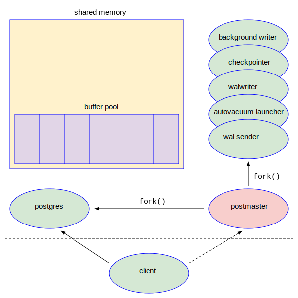

## PostgreSQL的体系架构概览

完成了PostgreSQL学习环境的搭建之后，我们要对PostgreSQL的体系结构做一个整体的概述，使得读者心中有一副完整的地图，方便后面的学习。简而言之，任何数据库都离不开三大件：文件，内存和进程。PostgreSQL也不例外。PostgreSQL的整体结构，可以用下图来表示：



注意：本书的示例图中一般用椭圆形表示进程，矩形表示内存。下面我们结合这个体系架构图依次来介绍PostgreSQL的进程，内存和文件。

### PostgreSQL的进程

#### 程序，进程和线程

我们知道，我们可以使用各种语言编写软件，如C，Java, Go, Rust, Python等等。这些被编写好的文件，可以运行起来提供各种功能。这种可以被执行的文件，叫做“程序”(Program)。当然了，如果用C/Java等编译型语言编写好的源程序，还需要被编译器编译成最终的二进制的可执行文件。我们在第一节使用make命令的过程就是编译，它实际上是调用gcc编译器对PostgreSQL的C语言源程序进行了编译，最终产生了$PGHOME/bin/postgres这个文件。它是个可执行文件，就是我们PostgreSQL软件中最核心的一个程序。

程序是一个躺在磁盘上的文件，如果它不被运行，就没有多大用处。只有用户运行它后，它才能够为我们提供应有的服务。我们把已经运行起来的程序称为“进程”(process)。例如我们每打开一个熟悉的putty窗口，Windows操作系统就创建了一个进程。我们可以打开多个Putty窗口，就是启动了多个进程。这些Putty的进程可以在Windows下面的Task Manager里面被查看到。在Linux等类Unix操作系统中查看进程的主要命令就是ps。我们在上节的实验中已经使用过了。

操作系统会为进程分配很多资源，包括该进程独享的内存空间。为了进一步提高执行效率，人类又发明了“线程”(thread)的概念。简而言之，线程就是在进程内部多个可以并发执行的单元。线程的执行效率高，但是一个进程内部的多个线程共享本进程的内存，可能会产生冲突，这导致多线程程序编写起来比较困难。如果控制不好，采用线程技术会导致最终的软件稳定性存在一些问题，而且很不容易排查。

关于进程线程的概念和关系的进一步探讨，涉及到操作系统等深入的知识。我们不在这里做过多的展开。这两个概念是非常核心的概念，理解的越深入越好，所以你可以在互联网上搜索相关资料进一步研究。

数据库软件是非常重要的基础性软件，它需要经年累月地不间断运行，所以人类对它的稳定性有极高的要求。为了提高软件的稳定性，PostgreSQL只采用多进程的体系架构，拒绝使用线程。这导致了PostgreSQL的性能并不是最领先的，但是它的稳定性是所有用户都交口称赞的。正如本山大叔对我们的敦敦教诲：“不要看广告，要看疗效。谁用谁知道！” 作为一枚苦逼的数据库运维人员，我深深地知道稳定性意味着什么：没有人想半夜三更被老板的电话叫醒。PostgreSQL的性能和其它数据库，如MySQL，Oracle相比，差异并不大，在某些特定场合性能甚至更高。

#### 后台进程

当PostgreSQL数据库运行起来后，我们可以通过运行ps命令来查看它有哪些进程在运行：
```
/* 所有的pg进程都以postgre开头，所以可以用grep postgres进行过滤 */
$ ps -ef | grep postgres | grep -v grep 
postgres     817       1  0 22:32 ?        00:00:00 /opt/software/pg152/bin/postgres
postgres     818     817  0 22:32 ?        00:00:00 postgres: checkpointer
postgres     819     817  0 22:32 ?        00:00:00 postgres: background writer
postgres     821     817  0 22:32 ?        00:00:00 postgres: walwriter
postgres     822     817  0 22:32 ?        00:00:00 postgres: autovacuum launcher
postgres     823     817  0 22:32 ?        00:00:00 postgres: logical replication launcher
```
我们看到后台有好几个进程。我们可以把PostgreSQL的进程分为三类：
- 主进程 postmaster
- 后台进程 (backend process)
- 服务进程 (server process)

当我们执行例如"pg_ctl start"的命令启动PostgreSQL的时候，运行的程序是$PGHOME/bin/postgres这个可执行文件。它运行起来的进程叫做postmaster，是第一个进程，也称为“主进程”。postmaster会首先完成一些初始化的工作，最重要的步骤之一就是创建一块大的共享内存。紧接着postgres会通过fork()系统调用创建一系列的子进程。这些子进程被称为“后台”进程(backend process)，在后台默默地工作，分别处理不同的任务。在完成各种工作之后，postmaster会监听某一个TCP端口(缺省是5432)。当某一个客户端程序打算连接到PostgreSQL的时候，它首先用PostgreSQL服务器的IP地址和监听端口号和postmaster进程建立一个TCP连接。如果这个客户有正确的口令，postmaster就会再通过fork()系统调用创建一个服务进程(server process)，这个服务进程将一对一和客户端的进程建立TCP连接，并为其服务。

在上节的实验中，客户端软件psql和PostgreSQL数据库软件运行在同一台服务器上，它们直接的连接是本地连接，其连接过程和另外一台机器上的客户端进行的远程连接，并无太多本质上的不同。关于远程连接的配置和使用，我们后面再介绍。

从架构图中我们可以看出，主进程postmaster通过fork()，创建了多个子进程，如backgroud writer, checkpointer, walwriter等等，就是在右边的那些椭圆形。下面列出这些后台进程的主要功能，里面涉及的一些概念我们目前还不理解，所以你只要大致有一个印象就行了。这些后台进程的具体功能我们在后面会逐步介绍。
- background writer : 后台写进程
- checkpointer ： 检查点进程
- walwriter : 写WAL的进程
- autovacuum launcher : AUTOVACUUM的管理进程。

在上面的ps命令的输出中，我们注意一下817号进程/opt/software/pg152/bin/postgres。这个就是postmaster主进程。如果你的Linux环境支持pstree命令，你可以执行如下命令：
```
$ pstree -p 817
postgres(817)─┬─postgres(818)
              ├─postgres(819)
              ├─postgres(821)
              ├─postgres(822)
              └─postgres(823)
```
这个命令显示出进程818,819,821,822和823的父进程是817。这清晰地展示了它们之间的父子兄弟关系。然后我们执行psql进行本地连接，再查看进程信息：
```
$ psql
psql (15.2)
Type "help" for help.

postgres=# \! ps -ef | grep postgres | grep -v grep
postgres     817       1  0 22:32 ?        00:00:00 /opt/software/pg152/bin/postgres
postgres     818     817  0 22:32 ?        00:00:00 postgres: checkpointer
postgres     819     817  0 22:32 ?        00:00:00 postgres: background writer
postgres     821     817  0 22:32 ?        00:00:00 postgres: walwriter
postgres     822     817  0 22:32 ?        00:00:00 postgres: autovacuum launcher
postgres     823     817  0 22:32 ?        00:00:00 postgres: logical replication launcher
postgres     870     710  0 23:06 pts/0    00:00:00 psql
postgres     871     817  0 23:06 ?        00:00:00 postgres: postgres postgres [local] idle

postgres=# \! pstree -p 817
postgres(817)─┬─postgres(818)
              ├─postgres(819)
              ├─postgres(821)
              ├─postgres(822)
              ├─postgres(823)
              └─postgres(871)
```
仔细对比和前面实验的不同，我们会发现多出了两个进程：870和871。其中870是客户端进程psql。871进程是服务进程(server proces)。它是由postmaster进程通过fork()创建出来，用于服务870客户的。结合上述实验和架构图，我们很容易理解了PostgreSQL进程之间的关系。至于各个后台进程的作用，我们后面会逐步介绍。

### PostgreSQL的内存结构

任何进程都需要使用内存。内存分为两种，私有内存(private memory)和共享内存(shared memory)。
 - 私有内存是单供本进程独享的。进程和线程最大的区别之一是进程有自己独立的内存空间，线程没有。一个进程内部的线程要分享本进程的内存。通常情况下，别的进程无法访问本进程的私有内存。私有内存是通过类似malloc()的系统调用向操作系统申请的，通过free()释放后还给操作系统。私有内存又可以称为“本地内存”(local memory)。
 - 共享内存，顾名思义，就是允许多个进程都可以对这块内存进行读写操作。它往往是通过shmget()/mmap()等系统调用进行创建，使用munmap()进行释放。以后我们会深入讲解这块知识。

在架构图上最大的矩形框表示共享内存。在共享内存里面有很多组件，包括buffer pool, WAL buffer等等。这些知识会在后面深入研究。
```
$ ipcs

------ Message Queues --------
key        msqid      owner      perms      used-bytes   messages

------ Shared Memory Segments --------
key        shmid      owner      perms      bytes      nattch     status
0x00060c4f 0          postgres   600        56         6

------ Semaphore Arrays --------
key        semid      owner      perms      nsems

```
### 数据库集群

数据库存储的大量业务数据当然是放在磁盘上的文件中的。这些文件被称为“数据文件”(data file)。数据文件并没有在上述的架构图上展示出来。
在PostgreSQL中有一个重要的术语和数据文件紧密相关，那就是数据库集群(Database Cluster)。

### 辅助文件

在数据库中，除了占体积最大的数据文件以外，还有一些小不点文件。它们的体积虽然很微不足道，但是在PostgreSQL正常运行过程中也起到了不可替代的辅助作用。这些文件有参数文件，控制文件，锁文件等等。下面我们依次介绍。

#### 参数文件

#### 控制文件
```
$ pg_controldata -D /opt/data/pgdata1
pg_control version number:            1300
Catalog version number:               202209061
Database system identifier:           7203466097550442255
Database cluster state:               in production
pg_control last modified:             Wed 01 Mar 2023 10:32:14 PM MST
Latest checkpoint location:           0/3000148
Latest checkpoint's REDO location:    0/3000148
Latest checkpoint's REDO WAL file:    000000010000000000000003
Latest checkpoint's TimeLineID:       1
Latest checkpoint's PrevTimeLineID:   1
Latest checkpoint's full_page_writes: on
Latest checkpoint's NextXID:          0:739
Latest checkpoint's NextOID:          16441
Latest checkpoint's NextMultiXactId:  1
Latest checkpoint's NextMultiOffset:  0
Latest checkpoint's oldestXID:        716
Latest checkpoint's oldestXID's DB:   1
Latest checkpoint's oldestActiveXID:  0
Latest checkpoint's oldestMultiXid:   1
Latest checkpoint's oldestMulti's DB: 1
Latest checkpoint's oldestCommitTsXid:0
Latest checkpoint's newestCommitTsXid:0
Time of latest checkpoint:            Wed 01 Mar 2023 10:32:14 PM MST
Fake LSN counter for unlogged rels:   0/3E8
Minimum recovery ending location:     0/0
Min recovery ending loc's timeline:   0
Backup start location:                0/0
Backup end location:                  0/0
End-of-backup record required:        no
wal_level setting:                    replica
wal_log_hints setting:                off
max_connections setting:              100
max_worker_processes setting:         8
max_wal_senders setting:              10
max_prepared_xacts setting:           0
max_locks_per_xact setting:           64
track_commit_timestamp setting:       off
Maximum data alignment:               8
Database block size:                  8192
Blocks per segment of large relation: 131072
WAL block size:                       8192
Bytes per WAL segment:                16777216
Maximum length of identifiers:        64
Maximum columns in an index:          32
Maximum size of a TOAST chunk:        1996
Size of a large-object chunk:         2048
Date/time type storage:               64-bit integers
Float8 argument passing:              by value
Data page checksum version:           1
Mock authentication nonce:            02e6680a0eec0f68a2b225b2763c168877b188e5274748e95d159aef154ca26b
```

#### 锁文件


