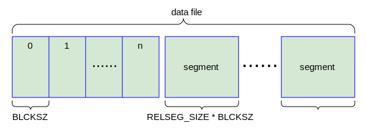

## PostgreSQL数据文件的结构

毫无疑问，数据文件是数据库中体积最大，也是最重要的文件之一。数据在数据文件中可以按行存储，也可以按列存储，由此产生了行式数据库（Row Oriented Databases）和列式数据库（Columnar Database）两种类型。传统的关系型数据库，包括Oracle,Microsoft SQL Server, MySQL和PostgreSQL都是行式数据库。本节我们对PostgreSQL数据文件的基本结构进行初步研究，以期有一个整体的印象。

### 数据文件的基本结构

在PostgreSQL中，每一张表对应一个数据文件。PostgreSQL的表的极限是32TB。很显然，这么巨大的文件不便于管理，且操作系统对于文件的尺寸有限制，譬如在32位的操作系统中，文件大小最大不能超过4G。为了方便地管理PostgreSQL的表，我们可以把对应于一个表的文件设想为一个“虚拟文件”，这个文件进一步被切分成很多小的物理文件。这些物理文件被称为这个虚拟文件的“段”(segment)。如下图所示：



在缺省情况下，PostgreSQL把数据文件的segment的最大尺寸设置为1G，这个尺寸的文件就比较好管理了。其中每一个segment，又被切分成了块(Block)。注意：Block的编号是从0开始的。在PostgreSQL的源代码中有两个常量，BLCKSZ规定Block的大小，单位是字节；RELSEG_SIZE规定数据文件segment的大小，单位是块。其缺省定义如下：
```c
/* in src/include/pg_config.h */
#define BLCKSZ 8192
#define RELSEG_SIZE 131072
```
由此我们可以看到，缺省情况下每个Block是8192个字节，而每个segment的大小是 RELSEG_SIZE * BLCKSZ (131072 * 8192 = 1G)。这两个参数是在编译的时候确定的，后期不能更改。我们查看configure的选项：
```
$ pwd
/home/postgres/code/postgresql-15.2
$ ./configure --help | grep SIZE
  --with-blocksize=BLOCKSIZE
  --with-segsize=SEGSIZE  set table segment size in GB [1]
```
所以为了改变Block和Segment的大小，我们在编译源代码的时候，可以使用上边两个选项。缺省的8192和1G对于绝大多数情况下都是非常理想的尺寸，所以一般情况下我们没有必要去改变这两个参数的设置。在本书中除非特别指明，我们把这两个参数的缺省值作为我们讲解的前提假设。


### 一个简单的实验

为了研究数据文件，我们做一个简单的小实验，其过程如下所示：
```
$ id      /* 本实验以postgres用户直接登录到PG服务器上开始 */
uid=1000(postgres) gid=1000(postgres) groups=1000(postgres) ...
$ psql
psql (15.2)
Type "help" for help.

postgres=# \c oracle   /* 连接到oracle数据库中，建议不要在postgres数据库中操作 */
You are now connected to database "oracle" as user "postgres".
oracle=# CREATE TABLE state(id INT, name CHAR(2));  /* 在oracle数据库中创建一个简单的表state */
CREATE TABLE
oracle=# SELECT pg_relation_filepath('state'); /* 通过pg_relation_filepath()函数拿到表文件的路径 */
 pg_relation_filepath
----------------------
 base/16388/16389
(1 row)

oracle=# \! ls -l $PGDATA/base/16388/16389   /* 通过ls -l命令查看这个文件在磁盘的信息 */
-rw------- 1 postgres postgres 0 Feb 24 14:38 /opt/data/pgdata1/base/16388/16389
/* 请注意上述文件的的大小，为0个字节，是因为这是一个空表，PG还没有为它分配真正的磁盘空间 */

oracle=# INSERT INTO state VALUES(0, 'TX'); /* 现在往state表中插入一条简单的记录 */
INSERT 0 1
oracle=# checkpoint; /* 为了保证数据真正写入到磁盘上，执行一个CHECKPOINT命令 */
CHECKPOINT
oracle=# \! ls -l $PGDATA/base/16388/16389
-rw------- 1 postgres postgres 8192 Feb 24 14:40 /opt/data/pgdata1/base/16388/16389
/* 再次查看该数据文件，发现它的大小为8192个字节 */
```
大家可以很清晰地看到，一个表对应磁盘上的一个文件，且该文件的名字是纯数字。当一个表拥有了第一个记录后，它的大小变成了8192个字节。由此我们可以推知，PostgreSQL为这个表分配了第一个Block，它的编号是0。

### Block/Page的结构分析

Block和Page是PostgreSQL世界里经常互换使用的两个术语。当数据文件的一个Block被读入到内存中后，内存中也会分配8K的空间来保存它，称之为Page（页）。简而言之：在磁盘上是Block，在内存中则为Page，两者的内容是一模一样的。下面我们就来分析Block/Page的基本结构。我们可以把整个Page划分为四个区域：
- 头部区域，又称为Page Header（页头）
- 数据指针区域
- 数据区域
- 特殊区域

一个Page的基本结构可以参考下图：


上图中的page header就是头部区域，其后的lp[1]到lp[n]的数组是数据指针区域。从Page的尾部往前看，是特殊区域(special area)。特殊区域的前面是数据区域，存放着真正的数据。数据指针区域的lp数组的每一个成员对应数据区的一条记录(tuple)。这里需要注意两点：一是记录的编号从1开始，不是从0开始。其二，数据指针区域和数据区域是相向增加的，它们中间的空白部分就是本Page的可用空间。

#### 页头(Page Header)的结构

现在我们来研究一下Page Header的具体组成。它是一个C语言的结构体（struct），叫做PageHeaderData。其相关定义如下：
```c
/* in src/include/c.h */
#define FLEXIBLE_ARRAY_MEMBER   /* empty */
typedef uint32 TransactionId; /* 32-bit */
typedef uint16 LocationIndex;

/* in src/include/storage/itemid.h */
typedef struct ItemIdData {
    unsigned  lp_off:15,    /* offset to tuple (from start of page) */
              lp_flags:2,   /* state of line pointer, see below */
              lp_len:15;    /* byte length of tuple */
} ItemIdData;

/* in src/include/storage/bufpage.h */
typedef struct {
    uint32  xlogid;   /* high bits */
    uint32  xrecoff;  /* low bits */
} PageXLogRecPtr;

typedef struct PageHeaderData {
    PageXLogRecPtr pd_lsn;         /* LSN */
    uint16         pd_checksum;    /* checksum，用来校验本Page是否损坏 */
    uint16         pd_flags;       /* flag bits */
    LocationIndex  pd_lower;       /* offset to start of free space */
    LocationIndex  pd_upper;       /* offset to end of free space */
    LocationIndex  pd_special;     /* offset to start of special space */
    uint16         pd_pagesize_version;
    TransactionId  pd_prune_xid;   /* oldest prunable XID, or zero if none */
    ItemIdData     pd_linp[FLEXIBLE_ARRAY_MEMBER]; /* line pointer array */
} PageHeaderData;
```
PageHeaderData的重要成员变量介绍如下：
- pd_lsn是一个8个字节，表示LSN（Log Sequence Number）。LSN是PostgreSQL的核心概念，我们在第三章介绍WAL的时候再深入理解这个概念的含义。现在我们可以把它跳过去。
- pd_checksum是校验码，用于校验本Page是否损坏。
- pd_lower/pd_upper/pd_special是三个内部指针，指向本Page的各种关键位置信息。
- pd_pagesize_version记录了本Page的大小和PostgreSQL的版本信息。
- pd_prune_xid是pruning的事务ID，以后会介绍。现在可以忽略。
- pd_linp是一个可变长的数组，每个成员是4个字节，后面我们会讲解。

pd_lower/pd_upper/pd_special都是16-bit的无符号整数，它们是在本Page中相对的偏移量。pd_lower指向了空白区域的起点，pd_upper指向了空白区域的终点。pd_special指向了特殊区域的起点。假设一个指针 char* p指向了某一个Page的开始，则 p + pd_lower就是指向本Page空白区域的起始位置，新的数据插入的位置就很容易计算出来了。

因为这三个本地指针都是16-bit，所以它们的最大长度是2^16 = 64KB。这也是PostgreSQL在目前的数据结构下Block/Page的最大尺寸。但是在ItemIdData里面的指针lp_off是15-bit，所以它能够寻址的空间是2^15 = 32KB。所以我们说PostgreSQL的Block和Page最大可以设置为32KB，但是通常我们都选择缺省的8KB，这是对OLTP事务性数据库和OLAP分析性数据库比较折中和平衡的设置。Oracle/Microsoft SQL Server缺省的Page尺寸也是8KB。

```c
typedef uint16 OffsetNumber;
/* in src/include/storage/block.h */
typedef struct BlockIdData {
    uint16          bi_hi;
    uint16          bi_lo;
} BlockIdData;

/* in src/include/storage/itemptr.h */
typedef struct ItemPointerData {
    BlockIdData ip_blkid;
    OffsetNumber ip_posid;
} ItemPointerData;
```
BlockIdData是4字节，标识一个表的数据文件的Block号，所以在BLCKSZ = 8K的情况下，一个表最大的体积是4G X 8K = 32T。你可以把BLCKSZ设置为32K，则最大的表的体积是128T。

hexdump是一个把任何文件的内容以16进制的格式显示的工具，是万能的，也是最暴力分析工具。我们也可以使用hexdump来直接把在3.2.1小节中产生的数据文件dump出来，用于验证PageHeaderData的各成员变量。具体操作如下：
```
postgres=# CHECKPOINT;  /* 为了确保数据真正写入磁盘，我们手工执行一下检查点 */
CHECKPOINT              /* 检查点checkpoint的概念我们在下一章进行介绍 */
postgres=# \! hexdump -C $PGDATA/base/16388/16389
00000000  00 00 00 00 28 9a b0 01  31 cf 00 00 1c 00 e0 1f  |....(...1.......|
00000010  00 20 04 20 00 00 00 00  e0 9f 3e 00 00 00 00 00  |. . ......>.....|
00000020  00 00 00 00 00 00 00 00  00 00 00 00 00 00 00 00  |................|
*         /* 这行的星号表示重复上一行的内容很多次，减少屏幕上的输出 */ 
00001fe0  e0 02 00 00 00 00 00 00  00 00 00 00 00 00 00 00  |................|
00001ff0  01 00 02 00 02 08 18 00  00 00 00 00 07 54 58 00  |.............TX.|
00002000
```
拿到上述数据，我们稍微耐心一点就可以分析出各个成员变量的值。
- pd_lsn =
- pd_lsn =

这个实验和分析可以展示Block的最原始的面目，让我们对Block的各个结构有了更加实在的体验。

### HeapTupleHeaderData之分析

为了进一步理解PageHeaderData各成员变量的含义和整个Page的结构，我们可以参考下图：


### 分析Block/Page结构的工具

为了分析Block/Page的内容，PostgreSQL提供了两个工具: pageinspect和pg_filedump。本节介绍这两个工具的基本使用。当然，hexdump也是我们工具箱里面不可或缺的工具。

#### Page分析工具pageinspect

为了分析Block/Page的内容，PostgreSQL提供了两个工具: pageinspect和pg_filedump。本节介绍这两个工具的基本使用。当然，，也是我们工具箱里面不可或缺的工具。
```
postgres=# select * from pg_extension;
  oid  | extname | extowner | extnamespace | extrelocatable | extversion | extconfig | extcondition
-------+---------+----------+--------------+----------------+------------+-----------+--------------
 12755 | plpgsql |       10 |           11 | f              | 1.0        |           |
(1 row)

postgres=# CREATE EXTENSION pageinspect;
CREATE EXTENSION
postgres=# select * from pg_extension;
  oid  |   extname   | extowner | extnamespace | extrelocatable | extversion | extconfig | extcondition
-------+-------------+----------+--------------+----------------+------------+-----------+--------------
 12755 | plpgsql     |       10 |           11 | f              | 1.0        |           |
 16392 | pageinspect |       10 |         2200 | t              | 1.11       |           |
(2 rows)

postgres=#
```
#### 再来一个pg_buffercache

为了分析Block/Page的内容，PostgreSQL提供了两个工具: pageinspect和pg_filedump。本节介绍这两个工具的基本使用。当然，hexdump是一个把任何文件的内容以16进制的格式显示的工具，是万能的，也是最暴力分析工具，也是我们工具箱里面不可或缺的工具。


#### Block分析工具pg_filedump

为了分析Block/Page的内容，PostgreSQL提供了两个工具: pageinspect和pg_filedump。本节介绍这两个工具的基本使用。当然，hexdump是一个把任何文件的内容以16进制的格式显示的工具，是万能的，也是最暴力分析工具，也是我们工具箱里面不可或缺的工具。

### 表空间

在这个小节介绍表空间的概念。


***
参考Link:
https://zhmin.github.io/posts/postgresql-buffer-page/

***
如果你使用initdb创建数据库的时候，有一个参数-k可以打开数据库的校验码验证功能。或者在数据库创建完毕后使用pg_checksums工具来打开或者关闭校验码功能。我们也可以使用pg_controldata工具来查看本数据库是否打开了校验码验证功能。示例如下：
```
$ $PGHOME/bin/pg_controldata | grep checksum
Data page checksum version:           1    /* 1表示校验码功能已经打开，0则表示关闭 */
```
