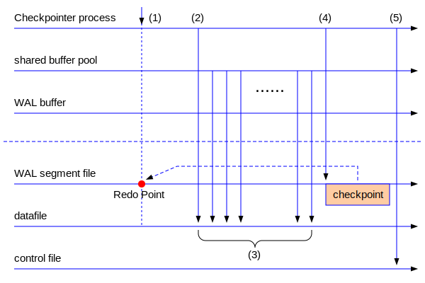
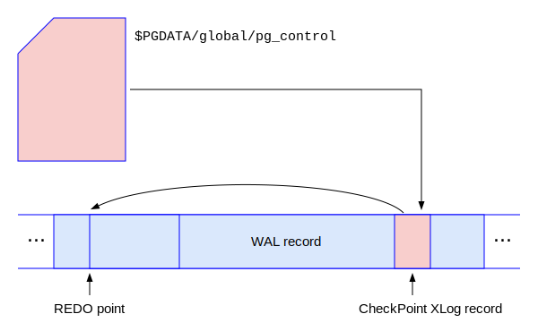
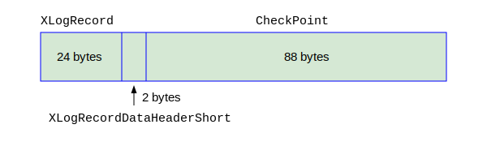
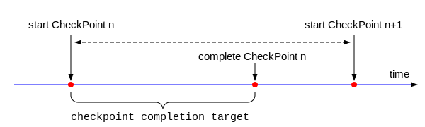
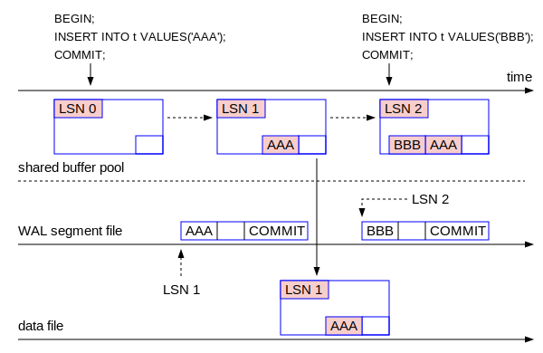

## 检查点 - CheckPoint

检查点(CheckPoint)是数据库的重要概念，搞懂检查点的概念是我们掌握备份恢复和流复制技术的基本前提。在第一节所展示的理论模型中，我们可以看到，为了恢复当前值18，如果我们只有基值6，就需要做七次加法运算。但是当我们把基值前移到了19，只需要做两次加法运算。为了加快对当前值的恢复，把基值从6前移到了19，这就是检查点概念的本质内容。在PostgreSQL中，检查点最主要的功能就是减少未来的数据库恢复时间。当一个检查点发生的时候，它会把内存中所有的脏页写回到磁盘上的数据文件中，这样的话，为了恢复当前状态，只需要检查点之后的WAL记录，而检查点之前的WAL记录就不再需要了。这大大减少的恢复数据库的时间。

检查点的触发条件有四种情况：
- 超级用户手工执行CHECKPOINT命令。
- 每隔一个固定的时间，PostgreSQL自动执行检查点。
- 每当WAL文件的体积超过一定大小的时候。
- 某一些特定操作，如开始备份，停机的时候。

下面我们就来分析检查点的到底做了什么工作。

### 检查点的执行过程

我们可以使用下图来展示CheckPoint的执行过程。在图中，水平实线表示各种对象，包括Checkpointer进程，Shared Buffer池，WAL Buffer，各种磁盘文件等等，其含义在左边对应列出。水平虚线分割上下两部分，上部分表示内存，下部分表示磁盘。



我们可以看到，一个检查点的执行总体上分为五个主要的动作：
- 步骤(1)是CheckPoint发生的开始，此时Checkpointer进程会首先记录当前的WAL指针的位置，称为REDO-Point，这也是一个非常重要的概念。
- 步骤(2)开始在shared buffer池中寻找脏页，依次把这些脏页写入到磁盘的数据文件中，即脏页的落盘。
- 步骤(3)表示把脏页落盘的过程。这个过程取决于有多少个脏页要落盘，本步骤的执行时间可能很长，持续几分钟甚至更长时间都不罕见。当所有的脏页都落盘后，就进入到了步骤(4)。
- 步骤(4)的动作是往WAL文件中插入一个CheckPoint的WAL记录。后面我们会详细分析该WAL记录的细节。
- 步骤(5)是把步骤(4)中的CheckPoint信息写入到控制文件。

CreateCheckPoint()函数是执行检查点的唯一函数，我们可以参考它的关键源代码来理解上述过程：
```c
/* in src/backend/access/transam/xlog.c */
void CreateCheckPoint(int flags)
{
    ...
    curInsert = XLogBytePosToRecPtr(Insert->CurrBytePos);
    ...
    checkPoint.redo = curInsert;   /* 步骤(1) - 把当前WAL的位置LSN记录在redo中 */
    ...
    /* 步骤(2)/(3) - CheckPointGuts函数是写脏页到数据文件中。它的执行时间最长 */
    CheckPointGuts(checkPoint.redo, flags); 
    ...
    XLogBeginInsert(); /* 步骤(4) - 把CheckPoint WAL记录写入WAL文件中 */
    XLogRegisterData((char *) (&checkPoint), sizeof(checkPoint));
    recptr = XLogInsert(RM_XLOG_ID, shutdown ? XLOG_CHECKPOINT_SHUTDOWN : XLOG_CHECKPOINT_ONLINE);

    XLogFlush(recptr);
    ...
    UpdateControlFile();  /* 步骤(5) - 更新控制文件 */
    ...
}
```
上述5个步骤都成功执行后，我们才称这个CheckPoint是成功的。这里面有一个关键的概念：重做点(REDO Point)。由于CheckPoint整个过程需要很长时间，Redo-Point是CheckPoint的起点，也是执行数据库恢复的起点，因为在Redo-Point之前的所有WAL记录都不再被当前数据库需要了。为什么呢？因为REDO-Point是从步骤(4)或者步骤(5)中拿到的，既然我们拿到了REDO-Point，则证明步骤(4)和(5)已经执行成功了，这也意味着步骤(3)执行成功了，即：所有的脏页都被可靠地写入了磁盘上的数据文件。在REDO-Point之前的WAL记录描述了脏页的变化，现在脏页已经不脏了，所以REDO-Point之前的WAL记录对于当前数据库就没有用处了。为了恢复当前数据库，必须要把REDO-Point作为起点，它右边的WAL记录对当前数据库的恢复才具有意义。如果步骤(3)失败了，会怎么样呢？步骤(3)失败了，则后面的步骤(4)和(5)也不会成功，则控制文件里面的内容不会被更新，控制文件依然记录着前一次成功地CheckPoint的位置。那么数据库恢复就从上一个REDO-Point开始，本次的REDO-Point就没有意义了。所以PostgreSQL启动的时候，会查看控制文件里面的检查点和REDO-Point信息，把控制文件里面记录的REDO-Point作为恢复的起点，请参考下图：



如上图所示，每次PostgreSQL启动数据库的时候，会首先查看控制文件里面的CheckPoint和REDO-Point的信息，并以这个REDO-Point的LSN作为数据库恢复的起点。我们可以查看控制文件里面的相关信息如下：
```
$ pg_controldata | grep checkpoint | grep location
Latest checkpoint location:           0/A0000A0
Latest checkpoint's REDO location:    0/A0000A0
```

### CheckPoint的WAL记录

CheckPoint的WAL记录的格式非常简单，只有三个部分：记录头，数据，外加中间一个小头，如下图所示：



图中的三部分的尺寸都是以PostgreSQL 15.2为准，后面的版本可能会稍微有一些不同。我们已经在上一节中介绍了XLogRecord的具体结构和各成员变量的含义。下面我们看一下XLogRecordDataHeaderShort和CheckPoint两个结构的具体定义。

XLogRecordDataHeaderShort的定义如下：
```c
/* in src/include/access/xlogrecord.h */
#define XLR_BLOCK_ID_DATA_SHORT     255
typedef struct XLogRecordDataHeaderShort {
    uint8  id;           /* XLR_BLOCK_ID_DATA_SHORT */
    uint8  data_length;  /* number of payload bytes */
} XLogRecordDataHeaderShort;
```
XLogRecordDataHeaderShort结构非常简单，就2个字节，id是固定的0xFF，另外一个字节data_lenght是数据部分的长度，最多只能表示255个字节。CheckPoint是该WAL记录的数据部分，它的数据结构定义如下：
```c
typedef uint32 TimeLineID;   /* 4 bytes */
typedef unsigned int Oid;    /* 4 bytes */
typedef TransactionId MultiXactId; /* 4 bytes */
/* in src/include/access/transam.h */
typedef struct FullTransactionId {
    uint64          value;
} FullTransactionId;

/* in src/include/catalog/pg_control.h */
typedef struct CheckPoint {
    XLogRecPtr        redo;  /* <---- REDO-Point */
    TimeLineID        ThisTimeLineID; /* current TLI */
    TimeLineID        PrevTimeLineID; /* previous TL */
    bool              fullPageWrites; /* current full_page_writes */
    FullTransactionId nextXid;      /* next free transaction ID */
    Oid               nextOid;                /* next free OID */
    MultiXactId       nextMulti;          /* next free MultiXactId */
    MultiXactOffset   nextMultiOffset;        /* next free MultiXact offset */
    TransactionId     oldestXid;        /* cluster-wide minimum datfrozenxid */
    Oid               oldestXidDB;    /* database with minimum datfrozenxid */
    MultiXactId       oldestMulti;        /* cluster-wide minimum datminmxid */
    Oid               oldestMultiDB;  /* database with minimum datminmxid */
    pg_time_t         time;                   /* time stamp of checkpoint */
    TransactionId     oldestCommitTsXid;
    TransactionId     newestCommitTsXid;
    TransactionId     oldestActiveXid;
} CheckPoint;
```
在上述成员变量中，根据我们目前的知识，我们只关心五个成员变量：
- redo
- ThisTimeLineID
- PrevTimeLineID
- fullPageWrites
- time

下面我们做一个小实验，在显微镜看一下一个检查点WAL记录的原始内容。
```
postgres=# \! pg_controldata | grep checkpoint | grep location
Latest checkpoint location:           0/33ED148  /* <---- 注意这里 */
Latest checkpoint's REDO location:    0/33ED110  /* <---- 注意这里 */
postgres=# checkpoint;
CHECKPOINT
postgres=# \! pg_controldata | grep checkpoint | grep location
Latest checkpoint location:           0/33ED230 /* <---- 注意这里 */
Latest checkpoint's REDO location:    0/33ED1F8 /* <---- 注意这里 */

postgres=# \! pg_controldata | grep TimeLine
Latest checkpoint's TimeLineID:       1   /* 当前的时间线 */
Latest checkpoint's PrevTimeLineID:   1

postgres=# SHOW wal_segment_size;
 wal_segment_size
------------------
 16MB   /* <----------------- WAL segment文件的大小是16MB */
(1 row)

```
从上面的实验，我们可以看出，当我们手工执行CHECKPOINT命令完毕后，控制文件里面的CheckPoint的LSN发生了前移的现象，从0/33ED148增加到了0/33ED230。目前的检查点的LSN是0/33ED230，当前的时间线是1，而且WAL segment文件的大小是16MB。根据前面我们我们学习的知识，可以推知：
- 这个检查点的WAL记录存放在000000010000000000000003文件当中
- 这个检查点在该文件中的偏移量是0x3ED230，即十进制的4117040

下面我们用万能的破解工具hexdump把这个文件从4117040开始的128个字节导出来，结果如下：
```
$ hexdump -C -s 4117040 -n 128 $PGDATA/pg_wal/000000010000000000000003
003ed230  72 00 00 00 00 00 00 00  F8 D1 3E 03 00 00 00 00  |r.........>.....|
003ed240  10 00 00 00 06 30 02 45  FF 58 F8 D1 3E 03 00 00  |.....0.E.X..>...|
003ed250  00 00 01 00 00 00 01 00  00 00 01 00 00 00 00 00  |................|
003ed260  00 00 E8 02 00 00 00 00  00 00 3D 40 00 00 01 00  |..........=@....|
003ed270  00 00 00 00 00 00 CC 02  00 00 01 00 00 00 01 00  |................|
003ed280  00 00 01 00 00 00 00 00  00 00 87 12 01 64 00 00  |.............d..|
003ed290  00 00 00 00 00 00 00 00  00 00 E8 02 00 00 00 00  |................|
003ed2a0  00 00 00 00 00 00 00 00  32 00 00 00 00 00 00 00  |........2.......|
```
hexdump显示的十六进制数字中的字母部分缺省是小写，但是因为我们往往用大写来表示LSN，所以我把上面的十六进制输出中的字母改成了大写，方便大家阅读。
根据上面的结果，我们可以分析出来：
- XLogRecord.xl_tot_len = 114 (0x72)，表明整个WAL记录是114个字节(24 + 2 + 88)。
- XLogRecord.xl_xid = 0
- XLogRecord.xl_prev = 0x33ED1F8 (LSN = 0/033ED1F8)
- XLogRecord.xl_info = 0x10
- XLogRecord.RmgrId = 0
- XLogRecord.xl_crc = 0x45023006

XLogRecordDataHeaderShort各成员变量的取值如下：
- XLogRecordDataHeaderShort.id = 0xFF /* = XLR_BLOCK_ID_DATA_SHORT */
- XLogRecordDataHeaderShort.data_length = 0x58 = 88，是后面CheckPoint结构的总长度。

CheckPoint各成员变量的取值如下
- CheckPoint.redo = 0/33ED1F8  /* <--------注意REDO point的LSN在这里获取!!! */
- CheckPoint.ThisTimeLineID = 1, 是当前时间线。
- CheckPoint.PrevTimeLineID = 1，是前一个时间线。
- CheckPoint.fullPageWrites = 1，表示TRUE，全页写处于激活状态。
- CheckPoint.time =  本CheckPoint发生的时间点。

我们可以用pg_waldump工具把这个检查点WAL记录打印出来，显示如下：
```
postgres=# \! pg_waldump -s 0/33ED230 -n 1
rmgr: XLOG        len (rec/tot):    114/   114, tx:          0, lsn: 0/033ED230, 
prev 0/033ED1F8, desc: CHECKPOINT_ONLINE redo 0/33ED1F8; /* <-- REDO point的LSN */
tli 1; prev tli 1; fpw true; xid 0:744; oid 16445; multi 1; offset 0; 
oldest xid 716 in DB 1; oldest multi 1 in DB 1; 
oldest/newest commit timestamp xid: 0/0; oldest running xid 744; online
```
我们可以对比hexdump和pg_waldump的输出，理解pg_waldump输出的各种信息的真正含义，要想进一步掌握pg_waldump的输出细节，可以参考如下的源代码：
```c
/* in src/backend/access/rmgrdesc/xlogdesc.c:xlog_desc() */
CheckPoint *checkpoint = (CheckPoint *) rec;

appendStringInfo(buf, "redo %X/%X; "
	 "tli %u; prev tli %u; fpw %s; xid %u:%u; oid %u; multi %u; offset %u; "
	 "oldest xid %u in DB %u; oldest multi %u in DB %u; "
	 "oldest/newest commit timestamp xid: %u/%u; "
	 "oldest running xid %u; %s",
	 LSN_FORMAT_ARGS(checkpoint->redo),
	 checkpoint->ThisTimeLineID,
	 checkpoint->PrevTimeLineID,
	 checkpoint->fullPageWrites ? "true" : "false",
	 EpochFromFullTransactionId(checkpoint->nextXid),
	 XidFromFullTransactionId(checkpoint->nextXid),
	 checkpoint->nextOid,
	 checkpoint->nextMulti,
	 checkpoint->nextMultiOffset,
	 checkpoint->oldestXid,
	 checkpoint->oldestXidDB,
	 checkpoint->oldestMulti,
	 checkpoint->oldestMultiDB,
	 checkpoint->oldestCommitTsXid,
	 checkpoint->newestCommitTsXid,
	 checkpoint->oldestActiveXid,
	 (info == XLOG_CHECKPOINT_SHUTDOWN) ? "shutdown" : "online");
```
因为我们在支持PostgreSQL数据库运维的时候，很少使用hexdump，更多会使用pg_waldump。通过上面的我们可以进一步解读pg_waldump命令输出的具体含义。希望大家认真把这个实验做一下，因为魔鬼都在细节里面。技术水平就在一点一滴中扎扎实实才能够成长起来。


### 重做点和检查点之间的关系

REDO-Point和CheckPoint


### 全页写 - Full Page Write (FPW)

定义如下：

```c
```
定义如下：




定义如下：



```c
```
定义如下：
```c
```
定义如下：
```c
```
定义如下：
```c
```
定义如下：
```c
```
定义如下：
```c
```
定义如下：
```c
```
定义如下：
```c
```
定义如下：
```c
```
定义如下：
```c
```
