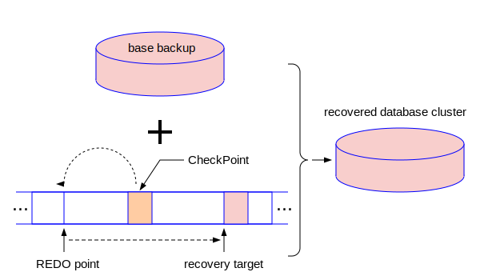
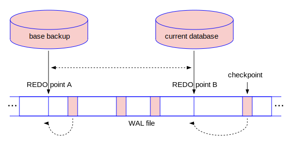
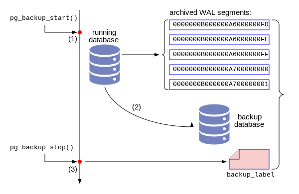
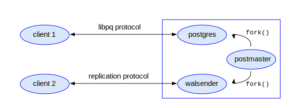
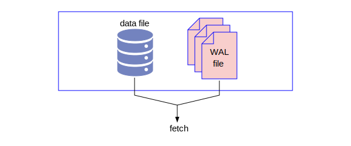

# 第四章 - 备份和恢复

作为数据库的运维人员，掌握数据库的备份和各种条件下的恢复的技术，是第一要务。当然，无法恢复的备份是无效的备份，所以我们必须深刻理解数据库备份和恢复的基本原理。根据上一章学习的WAL的知识，我们知道：一个基本备份加上连续的WAL记录，就可以恢复到WAL记录最大值之前的任何一个位置。如下图所示：



PostgreSQL开始做恢复之前，首先要通过某种渠道拿到一个检查点CheckPoint，然后根据这个CheckPoint中包含的redo的LSN，找到RedoPoint，从RedoPoint开始往右移动，依次把WAL记录回放到基本备份的数据文件中，直到你规定的恢复目标点才停止，就是图中所指的恢复目标(recovery target)。这个恢复目标点也是一个LSN，表示它在WAL文件中的位置。它也可以用时间点的方式提供，因为用户往往不知道LSN，只知道他想把数据恢复到昨天中午12点半。只有对恢复的基本原理有深刻的理解，我们才能在不同复杂的场景下完成数据恢复的工作。

## 备份

PostgreSQL的备份方式分为物理备份和逻辑备份两种。所谓物理备份就是把数据文件和WAL文件直接拷贝到备份的目录。逻辑备份就是把数据库中的数据转化成SQL语句，写入一个脚本文件中。在这个脚本文件里面包含大量的INSERT语句。恢复的时候运行这个脚本，完成数据的恢复。

### 归档模式和非归档模式

PostgreSQL的运行模式可以分配归档模式和非归档模式。它们的概念和区别可以用下图来表示：



如图所示，在右上角的数据库是当前数据库，与之对应的有一个重做点RedoPint B，则意味着为了恢复当前数据库，只需要RedoPoint B和之前的WAL记录，落后于该点的所有WAL记录是不需要的。假设我们有一个基本备份，如图中左上角所示，它对应的重做点RedoPoint A。虽然RedoPoint A和RedoPoint B之间的WAL记录是为了恢复当前数据库不需要的，但是却是为了恢复从基本备份开始所需要的。关于是不是需要保留RedoPoint B之后的WAL记录，有两种可能：
- 不保留RedoPoint B之后的WAL记录，则此数据库处于非归档模式。
- 保留RedoPoint B之后的WAL记录，则此时数据库处于归档模式。

所谓归档，是把档案归类保存之意，在这里实际上就是把RedoPoint B之后的，当前数据库不需要的，“老”的WAL segment文件拷贝到一个指定的地方（目录）。在归档模式下，每当WAL segment文件进行切换的时候，PostgreSQL会采用某种拷贝命令把RedoPoint B之后的WAL记录对应的WAL segment文件拷贝到一个指定的目录。我们可以把这个目录称为“归档目录”。下面我们演示如何判断和修改PostgreSQL的归档模式：
```
$ psql  /* 以超级用户用psql登录数据库 */
psql (15.2)
Type "help" for help.

postgres=# SHOW archive_mode;
 archive_mode
--------------
 off            /* <-- 目前处于非归档模式 */
(1 row)

postgres=# \! cat $PGDATA/postgresql.conf | grep archive_mode /* 检查archive_mode参数 */
#archive_mode = off    # enables archiving; off, on, or always

postgres=# \! vi $PGDATA/postgresql.conf /* 修改postgresql.confg配置文件 */
/*  再次检查archive_mode和archive_command参数 */
postgres=# \! cat $PGDATA/postgresql.conf | grep 'archive_mode\|archive_command'
archive_mode = on
archive_command = 'test ! -f /home/postgres/archivedir/%f && cp %p /home/postgres/archivedir/%f'

$ mkdir /home/postgres/archivedir  /* 创建archive_command命令中的目录 */
/* 需要重新启动数据库才能是archive_mode参数的修改生效 */
$ pg_ctl restart
waiting for server to shut down.... done
server stopped
......
server started
$ psql  /* 再次以超级用户用psql登录数据库 */
psql (15.2)
Type "help" for help.

postgres=# SHOW archive_mode; /* 检查archive_mode参数，结果为on */
 archive_mode
--------------
 on
(1 row)

postgres=# SHOW archive_command; /* 检查archive_command参数 */
                               archive_command
------------------------------------------------------------------------------
 test ! -f /home/postgres/archivedir/%f && cp %p /home/postgres/archivedir/%f
(1 row)

postgres=# \! ls -l /home/postgres/archivedir /* 检查该目录，结果为空 */
total 0
postgres=# SELECT pg_switch_wal();  /* 做一次WAL segment文件的切换 */
 pg_switch_wal
---------------
 0/40000F0
(1 row)

postgres=# \! ls -l /home/postgres/archivedir 
total 32768         /* 再次检查该目录，结果发现老的WAL segment文件被自动拷贝到该目录了 */
-rw------- 1 postgres postgres 16777216 Mar  3 06:37 000000010000000000000003
-rw------- 1 postgres postgres 16777216 Mar  3 06:37 000000010000000000000004

```
从上面的实验，我们可以了解到，archive_mode参数控制PostgreSQL的归档模式：archive_mode=off则为非归档模式，archive_mode=on则为归档模式。修改这个参数后需要重启数据库让它才能生效。当PostgreSQL处于归档模式(archive_mode=on)的时候，还必须设置另外一个参数archive_command来指定归档动作的具体命令。

#### 归档动作archive_command

（也就是拷贝老的WAL segment文件）

### 使用底层函数完成物理备份

PostgreSQL物理备份的过程实际上非常简单，一共分为三步：
- 通过psql执行pg_backup_start()函数
- 使用诸如tar, cp -R等操作系统的拷贝命令把整个数据库集群备份到某一个目录或者磁盘中。
- 在第一步的psql会话中，执行pg_backup_stop()函数结束备份。

```
这里是实验过程
```
整个过程如下图所展示：



#### pg_backup_start()做的工作

执行pg_backup_start()函数是物理备份的第一步。它有两个参数。第一个参数label是一个字符串，表示本次备份的标签。第二个参数fast，表示是立刻执行CHECKPOINT，还是等CHECKPOINT自己慢悠悠地完成。

那么pg_backup_start()幕后执行了如下动作
1. 强制进入全页写模式(Full Page Write)。
2. 切换WAL文件
3. 执行检查点CHECKPOINT
4. 创建backup_label 文件

具体代码
```c
/* in src/backend/access/transam/xlog.c:do_pg_backup_start() */

XLogRecPtr do_pg_backup_start(const char *backupidstr, bool fast, TimeLineID *starttli_p,
                              StringInfo labelfile, List **tablespaces,
                              StringInfo tblspcmapfile)
{
    ......
    XLogCtl->Insert.forcePageWrites = true; /* 步骤1 - 强制设置为全页写模式 FPW = true */
    ......
    /* 步骤2 - 切换WAL segment文件 */
    if (!backup_started_in_recovery) RequestXLogSwitch(false);
    ......
    /* 步骤3 - 触发一个CHECKPOINT，注意这里fast变量就是pg_backup_start()函数的第二个参数 */
    RequestCheckpoint(CHECKPOINT_FORCE | CHECKPOINT_WAIT | (fast ? CHECKPOINT_IMMEDIATE : 0));
    ......
    /* 步骤4 - 构建 backup_label文件的内容 */
    appendStringInfo(labelfile, "START WAL LOCATION: %X/%X (file %s)\n",
                                 LSN_FORMAT_ARGS(startpoint), xlogfilename);
    appendStringInfo(labelfile, "CHECKPOINT LOCATION: %X/%X\n",
                                 LSN_FORMAT_ARGS(checkpointloc));
    appendStringInfo(labelfile, "BACKUP METHOD: streamed\n");
    appendStringInfo(labelfile, "BACKUP FROM: %s\n",
                                 backup_started_in_recovery ? "standby" : "primary");
    appendStringInfo(labelfile, "START TIME: %s\n", strfbuf);
    appendStringInfo(labelfile, "LABEL: %s\n", backupidstr);
    appendStringInfo(labelfile, "START TIMELINE: %u\n", starttli);
    ......
}
```
#### pg_backup_stop()做的工作

有待补充。。。。。。

### 使用pg_basebackup进行备份



我们先用psql从192.168.137.151上进行普通的远程登录：
```
[postgres@pg1 ~]$ psql -h 192.168.137.153 -p 5432 -U postgres -d postgres
Password for user postgres:
psql (15.2)
Type "help" for help.

postgres=# IDENTIFY_SYSTEM;
ERROR:  syntax error at or near "IDENTIFY_SYSTEM"
LINE 1: IDENTIFY_SYSTEM;

postgres=# SELECT pg_backend_pid();
 pg_backend_pid
----------------
          16068
(1 row)
```
然后我们以replication协议登录后台
```
[postgres@pg1 ~]$ psql "dbname=postgres replication=database" -h 192.168.137.153 -p 5432 -U postgres
Password for user postgres:
psql (15.2)
Type "help" for help.

postgres=# IDENTIFY_SYSTEM;
      systemid       | timeline |  xlogpos  |  dbname
---------------------+----------+-----------+----------
 7203466097550442255 |        1 | 0/7000998 | postgres
(1 row)

postgres=# SELECT pg_backend_pid();
 pg_backend_pid
----------------
          16077
(1 row)
```
然后我们在后台查看相关进程
```
$ ps -ef | grep "16077\|16068" | grep -v grep
postgres   16068   15957  0 23:17 ?        00:00:00 postgres: postgres postgres 192.168.137.151(52772) idle
postgres   16077   15957  0 23:19 ?        00:00:00 postgres: walsender postgres 192.168.137.151(52780) idle
```

前面已经说过，使用底层函数进行备份的方式已经逐步放弃了。我们更多的备份是使用PostgreSQL自带的备份工具pg_basebackup来完成备份。



前面已经说过，使用底层函数进行备份的方式已经逐步放弃了。我们更多的备份是使用PostgreSQL自带的备份工具pg_basebackup来完成备份。


