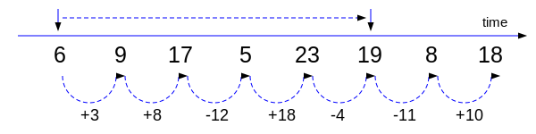
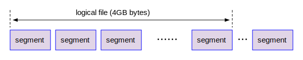

# 第三章 - 理解提前写日志 - WAL

WAL是LWrite Ahead Log的简称，中文可以翻译成“提前写日志”，是PostgreSQL数据库的核心概念之一。它也是Oracle/SQL Server/MySQL等传统数据库的核心概念。在Oracle中WAL被叫做Redo，SQL Server中WAL被叫做Transaction Log。对于它的深入理解，是我们掌握PostgreSQL数据库备份和恢复，Standby服务器和逻辑复制服务器搭建的重要前提条件。本章的内容就是对WAL相关的知识进行基本性的介绍。

## WAL背后的原理

为了理解WAL，我们先考察一个极其简单的理论模型。请参考下图：

如上图所示，假设我们有一个数字，它在不停的变化，每次变化以后，就会立刻通知观察者。从上图中可以看到，这个数字最初是6，依次变化为9,17,5,23等等。为了要记录这个数字的变化情况，观察者首先能够想到的方案就是：当接到通知后就去观察这个数字，并且把它记录在笔记上，所以观察者的笔记里面记录的是6,9,17,5等数字，可能还有每次观察的时间点等信息。除了这种自然的记录方案以外，我们还可以有第二种记录方案，就是首先记录一个起始值6，然后只记录一下增量值。譬如当6变成9的时候，我们只记录3，因为6 + 3 = 9嘛。所以一旦有了一个初始值，再加上一个增量，观察者就可以计算得到下一个变化的值。我们称这个初始值为基值，只要一个基值6和连续的增量信息，就是底部的+3, +8, -12, +18等等，我们就可以恢复从基值开始变化的任何一种状态。 在这种方案中，我们还可以观察到另外一个规律：就是要从基值6恢复到第8个数字18，我们需要进行7次加法运算。但是当我们把基值调整为19,也就是第6个数字的时候，只需要两次的加法运算，恢复的速度大大提高了。

很显然，第二种基值加增量的方案在这个极其简单的理论模型中，并没有任何优势。但是我们把注意力放在数据库设计领域的时候，第二种方案就有了很大的优势。为什么呢？目前所有的数据库都是在机械磁盘时代设计出来的。在机械磁盘时代，有一个事实，那就是：对机械磁盘的顺序写的速度要远远大于随机写的速度。加上这个前提，我们再来考察上述的第二种方案。如果记录原始值是随机写的，增量的值是顺序写的，写少数原始值加连续的增量，写入速度明显比只纯写原始值要快得多，那么第二种方案就有了很大的优势。这就是WAL的思想起源。WAL就是图上增量的值，它是连续且顺序写入到磁盘文件上的。为了提高恢复速度，我们把基值从6往前移动到9，这个过程在数据库领域称为检查点(Check Point)。这些都是数据库里面的重要概念。理解了这个简单的模型和思想，我们就可以考察PostgreSQL里面如何实现基值加增量的存储方案，以及WAL和检查点等重要概念的基本含义。

## 什么是WAL？

WAL也可以被称为WAL记录(WAL Record)。我们已经知道了真正的表的数据在磁盘上是按8192个字节存储的Block，在内存中则为8192个字节大小的Page。当我们对表的数据进行的修改，包括增加，删除和修改等任何改变数据的操作，就是在内存中修改对应的Page中的数据。这个被修改后的Page被称为脏页(Dirty Page)。该Page变脏以后，并不会立刻被回写到磁盘上，而是把这些增删改的操作产生对应的以某种“特殊”格式存储的修改记录，我们称为WAL记录。当修改的操作对应的事务(Transaction)被提交(Commit)后，对应的WAL记录会被写入磁盘上的WAL文件中，而且这种写入是顺序添加的文件的末尾的，即对磁盘的顺序写入。换句话说，当Page被修改后，真正的数据并不会被立刻写入，而是提前把WAL记录顺序写入到磁盘的WAL文件中，真正的数据以后再写入真正的数据文件中。这是“提前”的含义。由此看来，数据会被写两次，第一个次是写入以WAL记录作为最小单元，写入WAL文件。第二次是真正的数据页被写入到数据文件中。这里的要点是：
- 对数据的增加，删除或者修改等操作才会产生对应的WAL。查询是只读操作，一般不会产生WAL。
- 只有修改数据的操作对应的事务被提交后，对应的WAL才会完全写入到磁盘上的WAL文件中。
- WAL记录是按先后顺序不断追加到WAL文件尾部的。

WAL记录就类似上述理论模型中的增量值，而真正的数据块，类似基值。内存中的脏页写入到磁盘上对应的数据块的过程，是一种随机写的方式。正式有了随机写和顺序写的速度差异，导致数据中WAL的设计有了非常合理的基础。当我们拿到一个数据页，和对应的WAL记录，我们就可以恢复该数据页到下一个变化后的新状态。这种用WAL记录来修改数据块的行为叫做回放(Replay)。

## 什么是LSN?

LSN是PostgreSQL里面极其重要的底层概念，它等同于Oracle数据库中的SCN。理解LSN是理解WAL和检查点的前提。那么什么是LSN呢？LSN是Log Sequence Number的缩写，它本质是一个64-bit的无符号整数，来表示一个空间(Space)。空间这个概念对于学习过线性代数的读者来说并不陌生，它指的是一个集合。8个字节的LSN可以表示0x0000000000000000到0xFFFFFFFFFFFFFFFF这么多个数字，共计2^64(就是2的64次方)个，它们组成了一个集合，即为WAL空间。虽然这个空间不是无限的，但是也是非常非常非常巨大的空间，我们可以把它看成近乎无限大。

由于WAL记录是按照先后顺序写入WAL文件的，我们可以把WAL文件想象成一个一维的线性结构。现在我们设想所有的WAL记录收尾相连，存储在一个共计2^64个字节的长长的数组中。这个数组从左到右，每一个字节都有一个编号，第一个字节的编号是0，最后一个字节的编号是0xFFFFFFFFFFFFFFFF，如下图所示：

那么什么是LSN呢？其实它的定义非常简单，我们把每一个字节的编号称为该字节的LSN，这就是LSN的定义！假设某一个字节的偏移量是716751593320，就是十六进制的0xA6E1B95F68。为了方便阅读，我们把这8个字节分成高低各4个字节，中间用/分割，A6E1B95F68可以表示为A6/E1B95F68。这个就是该字节的LSN。虽然说WAL空间，或者说WAL数组里面的每一个字节都有唯一的LSN，但是后面我们就知道了，真正有效的WAL记录(WAL Record)是多个字节组成的信息载体，只有这条记录的第一个字节的LSN才是有效的，其余字节的LSN没有什么意义。所以给定一个LSN后，我们还得往前找到下一个完整的WAL记录的头一个字节，才算拿到了一个有效的LSN。

### WAL文件
根据上面的定义，我们知道整个WAL空间可以用一个文件来存储，它的体积是16EB，就是16777216TB。这是非常巨大的体积，在目前的技术条件下，无法存储这么大的文件。我们可以把这个巨大的虚拟文件分割成很多个连续的小文件，这些文件的体积目前工程上可以接受的，譬如16MB, 512MB，2GB等等。这些小文件就是我们即将触手可得的WAL文件。由于LSN是8个字节，可以分为高4个字节和低4个字节。我们可以把一个16EB的虚拟的WAL文件分割成4G大小的“小”文件，这些小文件一共4G的。这个4G大小的文件，我们称为WAL文件的逻辑文件(Logical File)。逻辑文件的编号从0x00000000到0xFFFFFFFF。但是4G大小的文件，通常情况下依然显得比较大，所以我们可以进一步把它划分成16MB，或者32MB，或者1GB大小的更容易处理的小小文件。这种小小文件的术语叫WAL Segment File，如下图所示：

WAL文件名分为三部分，如下图所示：

WAL segment file的结构

如上图所示，每一个WAL segment file也是按照8K划分成多个页。

### 检查点Checkpoint

LSN是offset!

Full Page Write的介绍

## pg_waldump工具的使用

https://zhmin.github.io/posts/postgresql-checkpoint/
https://zhmin.github.io/posts/postgresql-wal-format/

