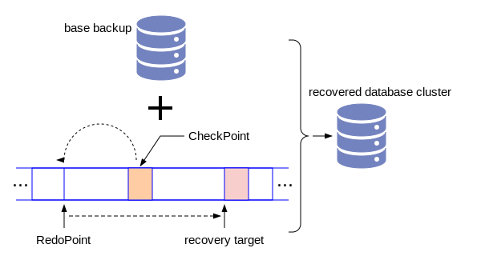

# 第四章 - PostgreSQL数据库的备份和恢复

作为数据库的运维人员，掌握数据库的备份和各种条件下的恢复的技术，是第一要务。首先我们要学习如何做备份。当然，无法恢复的备份是无效的备份，所以我们必须了解数据库恢复的基本原理。根据上一章我们所学习的WAL的知识，我们知道，一个基本备份加上连续的WAL记录，就可以恢复到WAL记录最大值之前的任何一个位置。如下图所示：



PostgreSQL开始做恢复之前，首先要通过某种渠道拿到一个检查点，然后找到REDO Point，从REDO point开始往前移，依次把WAL记录回放到基本备份的数据文件中，直到你规定的恢复目标点才停止，就是图上所指的recovery target。这个恢复目标点也是一个LSN，表示它在WAL文件中的位置。它也可以用时间点的方式提供，因为用户往往不知道LSN，只知道他想把数据恢复到昨天中午12点半。只有对以上恢复的基本原理有深刻的理解，我们才能在不同复杂的场景下完成数据恢复的工作。

## 备份

PostgreSQL的备份方式分为物理备份和逻辑备份两种。所谓物理备份就是把数据文件和WAL文件直接拷贝到备份的目录。逻辑备份就是把数据库中的数据转化成SQL语句，写入一个脚本文件中。在这个脚本文件里面包含大量的INSERT语句。恢复的时候运行这个脚本，完成数据的恢复。

本节重点讲解物理备份的步骤和背后的技术内幕。

### 使用底层函数完成物理备份

首先我们展示如何做物理备份
```
这里是实验过程
```

由上面的实验我们可以看出，物理备份的方式实际上非常简单，如下图所示：


作为数据库的管理人员，掌握数据库的备份和各种条件下的恢复技能，是第一要务。

