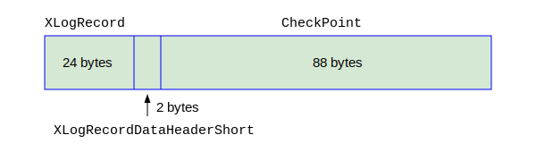

## 检查点CheckPoint

检查点CheckPoint是数据库的重要概念。


三个重要的检查点相关参数




三个重要的检查点相关参数

定义如下：


```c
```
定义如下：


```c
```
定义如下：


```c
```
定义如下：
```c
```
定义如下：
```c
```
定义如下：
```c
```
定义如下：
```c
```
定义如下：
```c
```
定义如下：
```c
```
定义如下：
```c
```
定义如下：
```c
```
定义如下：
```c
```
定义如下：
```c
```
