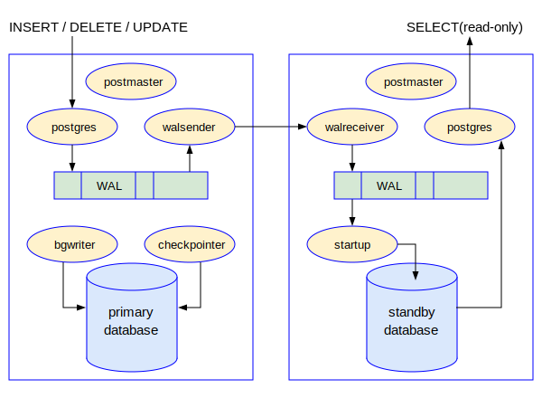

# 第五章 - 流复制和逻辑复制

通过上一章的学习，我们已经对PostgreSQL数据库的备份和恢复，以及WAL的基本作用有了一个整体的了解。WAL记录除了可以用在本地数据库的恢复以外，也可以通过网络传输到远端，恢复远端的数据库。这就诞生了数据库的远程复制技术。远程复制技术是实现数据库高可用性的主要技术手段，也是企业迫切需要的核心功能。从实质上来说，远程复制和本地恢复并无本质的区别，其核心都是使用WAL来恢复数据库，无非一个是本地手动执行，一个是把WAL记录通过网络传输到远端，自动执行罢了。下图就是远程复制技术的总体概念：


远程复制技术分为物理复制和逻辑复制两种类型。简单来说，物理复制就是本地恢复的远端版本，也是把WAL记录回放的方式恢复远端的数据库。逻辑复制是把WAL记录进行解码，变成了SQL语句，在远端执行。逻辑复制带来了更多的灵活性。各大主流数据库都有自己的复制技术，Oracle数据库有Data Guard物理复制和GoldenGate逻辑复制解决方案。微软的SQL Server有Always On的解决方案。作为号称最先进的开源数据库的PostgreSQL当然也有自己的物理流复制和逻辑复制技术，这些就是本章的核心内容。

## 流复制

PostgreSQL流复制的体系架构可以用下图来表示：



在上图中，左边的大矩形框表示主库，右边的大矩形框表示备库。主库的用户发起的修改数据的事务(INSERT/DELETE/UPDATE)，相关的WAL记录会被写入到WAL文件中。这个大家已经非常熟悉了。在主库上有一个walsender的后端进程，会不断地读取WAL文件中的记录，通过TCP连接，传输给远端备库机器上的walreceiver进程。walreceiver进程收到来自主库的WAL记录后，会写入本地的WAL文件中。备库机器上还有一个startup进程，不断读取WAL文件中的WAL记录，把它们不断更新到数据文件上。


### 快速搭建流复制

我们先通过一个实验，快速搭建PostgreSQL的物理复制环境，给读者一个感性的认识。我们的实验环境分为两台计算机，一台计算机作为主库机器，IP地址是192.168.137.151，其上已经运行了PostgreSQL 15.2的数据库。另外一台计算机作为备库，它的IP地址是192.168.137.153，上面只安装好了15.2的软件，并没有数据库在运行。


下面是实验的具体内容：

#### 第一步：在主库机器上的工作
我们需要修改主库的若干参数，确保主库处于归档模式，可以接收远程客户的连接等等。因为有些参数需要重新启动主库后才能生效，所以我们首先把主库关闭。当主库关闭之后，修改postgresql.conf，设置如下参数
listen_addresses = '*'    
wal_level = replica
archive_mode = on
archive_command = 'test ! -f /home/postgres/archive/%f && cp %p /home/postgres/archive/%f'
hot_standby = on
```
在主库机器上创建一个用户
```
CREATE USER kevin WITH REPLICATION LOGIN PASSWORD 'Welcome123';
```
再修改pg_hba.conf，在文件的最后加上如下一行：
```
host    replication     kevin           192.168.137.153/32      md5
```
以上工作完毕后，启动主库。

#### 第二步：在备库机器上的工作

我们首先在备库机器上执行pg_basebackup创建一个备份。
```
$ pg_basebackup -h 192.168.137.151 -p 5432 -U kevin -D /opt/data/pgdata2 -Fp -R -c fast --wal-method=stream
Password:
```
当备份完成后，你会发现pg_basebackup创建了一个目录/opt/data/pgdata2。我们检查一下里面的内容：
```
$ pwd
/opt/data/pgdata2
$ ls -l
total 260
-rw------- 1 postgres postgres    225 Mar 11 10:42 backup_label    /* <--- */
-rw------- 1 postgres postgres 137040 Mar 11 10:42 backup_manifest
drwx------ 5 postgres postgres   4096 Mar 11 10:42 base
drwx------ 2 postgres postgres   4096 Mar 11 10:42 global
......
drwx------ 3 postgres postgres   4096 Mar 11 10:42 pg_wal
drwx------ 2 postgres postgres   4096 Mar 11 10:42 pg_xact
-rw------- 1 postgres postgres    334 Mar 11 10:42 postgresql.auto.conf
-rw------- 1 postgres postgres  29638 Mar 11 10:42 postgresql.conf
-rw------- 1 postgres postgres      0 Mar 11 10:42 standby.signal /* <--- */
```
然后修改postgresql.conf，加入如下参数：
```
primary_conninfo = 'host=192.168.137.1 port=5432 user=kevin password=Welcome123'
```
然后启动备库
```
$ pg_ctl start -l logfile -D /opt/data/pgdata2
```

#### 第三步：验证实验是否成功
为了验证我们搭建的流复制环境是否成功，分别登录主库和备库，在主库里面一张表里面插入一条记录
```
oracle=# CREATE TABLE state (id INT, name CHAR(2));
CREATE TABLE
oracle=# INSERT INTO state VALUES(0, 'MA');
INSERT 0 1
```
然后在备库上查询：
```
oracle=# SELECT id, name FROM state;
 id | name
----+------
  0 | MA
(1 row)
```
结果发现这条记录被立刻复制到了备库中，就说明了我们的实验顺利完成。

我们在备库上查看后台进程：
```
$ ps -ef | grep postgres
postgres     875       1  0 10:46 ?        00:00:00 /opt/software/pg152/bin/postgres -D /opt/data/pgdata2
postgres     876     875  0 10:46 ?        00:00:00 postgres: checkpointer
postgres     877     875  0 10:46 ?        00:00:00 postgres: background writer
postgres     878     875  0 10:46 ?        00:00:00 postgres: startup recovering 000000010000000000000003
postgres     879     875  0 10:46 ?        00:00:00 postgres: walreceiver streaming 0/3419D70
```
```
$ ps -ef | grep postgres
postgres  1474  1473  0 12:34 ?        00:00:00 postgres: checkpointer
postgres  1475  1473  0 12:34 ?        00:00:00 postgres: background writer
postgres  1477  1473  0 12:34 ?        00:00:00 postgres: walwriter
postgres  1478  1473  0 12:34 ?        00:00:00 postgres: autovacuum launcher
postgres  1479  1473  0 12:34 ?        00:00:00 postgres: archiver last was 000000010000000000000002.00000028.backup
postgres  1480  1473  0 12:34 ?        00:00:00 postgres: logical replication launcher
postgres  1522  1473  0 12:46 ?        00:00:00 postgres: walsender kevin 192.168.137.153(59470) streaming 0/3419E58
```

### 备库的启动及与主库的通讯过程


作为数据库的管理人员，掌握数据库的备份和各种条件下的恢复技能，是第一要务。


### 流复制的监控

作为数据库的管理人员，掌握数据库的备份和各种条件下的恢复技能，是第一要务。


