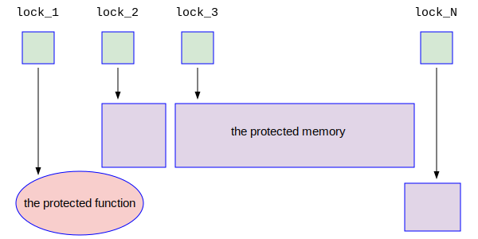
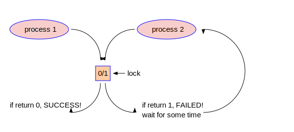
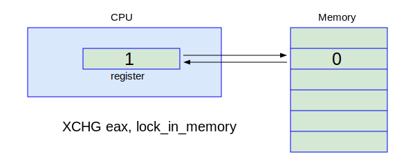
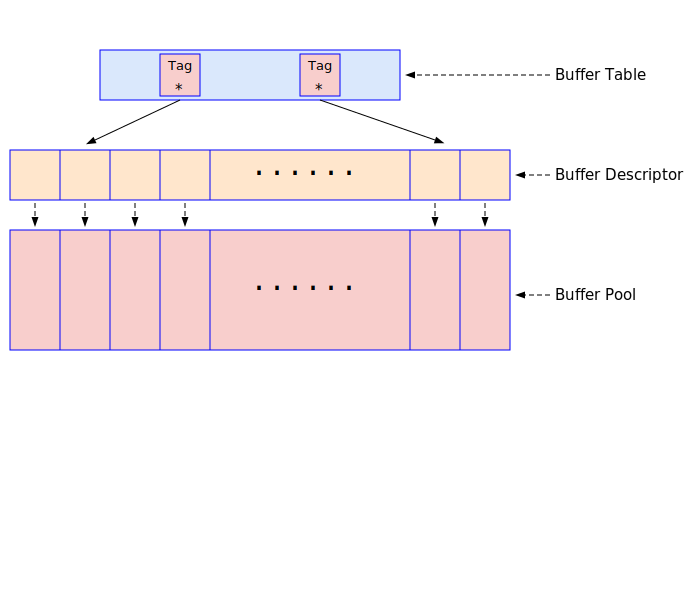

# 第六章 - 锁和共享内存


## 共享内存和信号量

### 共享内存

### 信号量

PostgreSQL的逻辑复制

## PostgreSQL中的锁



### 自旋锁

PostgreSQL的逻辑复制



#### X86/X64中的TAS

X86/X64中使用XCHG指令来实现TAS。XCHG指令很简单，其示意图如下：



EAX是X86 CPU中的一个寄存器，lock_in_memory是内存的一个地址。XCHG eax, lock_in_memory这条指令的功能是把EAX寄存器中的内容和lock_in_memory指向的内存单元中的内容互换。如果EAX中的内容为1, lock_in_memory中的内容为0，则XCHG eax, lock_in_memory这条指令执行完毕后，EAX中的内容变成了0，而lock_in_memory中的内容变成了1。因为一条指令具有原子性，即这条指令不会在执行中途被打断，这就实现了TAS功能。大家请看如下的代码：
```
locked:                      /* lock是一个内存单元，里面的值开始为0，表示没有上锁 */
     dd      0               /* 如果lock里面的值为1，则表示已经上锁了 */

spin_lock:                   /*  获取自旋锁的代码的开始部分 */
     mov     eax, 1          /* 往寄存器EAX中放入1 */
     xchg    eax, [locked]   /* 把EAX中的内容和lock内存单元中的值互换。现在lock内存中的值肯定为1了 */
     test    eax, eax        /* 测试EAX寄存器中的值是否为0。这个值就是先前lock内存中的值 */
     jnz     spin_lock       /* 如果EAX中的值为1，则表明这个lock正在被别人占用; 跳转到开始，继续尝试获取该自旋锁 */
     
     ret                     /* 如果EAX中的值为0，则表示lock锁没有被别人占用，就是我们拿到了，可以直接返回了 */
                             /* 此时lock中的值为1，别人再用这段代码试图获取该自旋锁的时候，就会不停地循环尝试 */

spin_unlock:                 /* 释放自旋锁的代码的开始部分 */
     xor     eax, eax        /* 把EAX寄存器清零，现在它里面的值为0 */
     xchg    eax, [locked]   /* 在locked的内存单元中放置EAX中的内容，即0值 */
     ret                     /* 返回。下次别人调用上面的代码试图获取该自旋锁的时候就可以轻松拿到了 */
```

### 轻量级锁


## PostgreSQL共享内存的结构

PostgreSQL的逻辑复制

### Shared Buffer池

PostgreSQL的逻辑复制



PostgreSQL的逻辑复制
