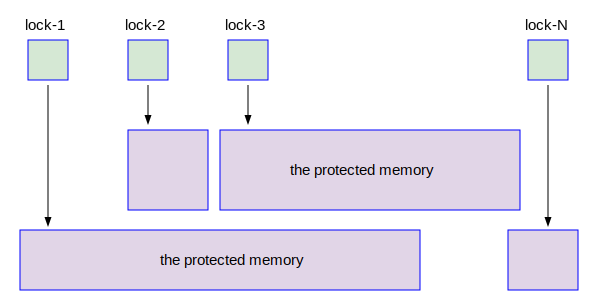

# 第六章 - 锁和共享内存

## 私有内存和共享内存

PostgreSQL的逻辑复制

## PostgreSQL中的锁

### 自旋锁

PostgreSQL的逻辑复制

#### X86/X64中的TAS

X86/X64中使用XCHG指令来实现TAS。XCHG指令很简单，其示意图如下：

EAX是X86 CPU中的一个寄存器，lock_in_memory是内存的一个地址。XCHG eax, lock_in_memory这条指令的功能是把EAX寄存器中的内容和lock_in_memory指向的内存单元中的内容互换。

## PostgreSQL共享内存的结构

PostgreSQL的逻辑复制

### Shared Buffer池

PostgreSQL的逻辑复制

PostgreSQL的逻辑复制
