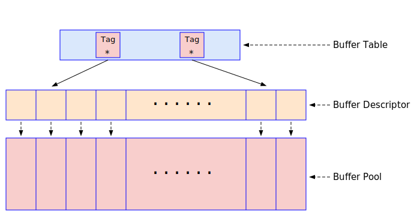

# 第六章 - 锁和共享内存


## 共享内存和信号量

### 共享内存

### 信号量

PostgreSQL的逻辑复制

## PostgreSQL中的锁


### 自旋锁

#### 自旋锁的原理

用下图解释


#### X86/X64中的TAS

X86/X64中使用XCHG指令来实现TAS。XCHG指令很简单，其示意图如下：


EAX是X86 CPU中的一个寄存器，lock_in_memory是内存的一个地址。XCHG eax, lock_in_memory这条指令的功能是把EAX寄存器中的内容和lock_in_memory指向的内存单元中的内容互换。如果EAX中的内容为1, lock_in_memory中的内容为0，则XCHG eax, lock_in_memory这条指令执行完毕后，EAX中的内容变成了0，而lock_in_memory中的内容变成了1。因为一条指令具有原子性，即这条指令不会在执行中途被打断，这就实现了TAS功能。大家请看如下的代码：
```
locked:                      /* locked是一个内存单元，里面的值开始为0，表示没有上锁 */
     dd      0               /* 如果locked里面的值为1，则表示已经上锁了 */

spin_lock:                   /* 获取自旋锁的代码的开始部分 */
     mov     eax, 1          /* 往寄存器EAX中放入1 */
     xchg    eax, [locked]   /* 把EAX中的内容和locked内存单元中的值互换。现在locked内存中的值肯定为1了 */
     test    eax, eax        /* 测试EAX寄存器中的值是否为0。这个值就是先前locked内存中的值 */
     jnz     spin_lock       /* 如果EAX中的值为1，则表明这个locked正在被别人占用; 跳转到开始，继续尝试获取该自旋锁 */
     
     ret                     /* 如果EAX中的值为0，则表示locked锁没有被别人占用，就是我们拿到了，可以直接返回了 */
                             /* 此时locked中的值为1，别人再用这段代码试图获取该自旋锁的时候，就会不停地循环尝试 */

spin_unlock:                 /* 释放自旋锁的代码的开始部分 */
     xor     eax, eax        /* 把EAX寄存器清零，现在它里面的值为0 */
     xchg    eax, [locked]   /* 在locked的内存单元中放置EAX中的内容，即0值 */
     ret                     /* 返回。下次别人调用上面的代码试图获取该自旋锁的时候就可以轻松拿到了 */
```

#### 自旋锁在PostgreSQL中的具体实现

下面我们研究一下PostgreSQL中对SpinLock的具体实现。
```c
/* in src/include/storage/spin.h */
/* 这些函数是外面的使用者应该使用的函数接口，硬件实现细节由它们隐藏。
 *      void SpinLockInit(volatile slock_t *lock)
 *              Initialize a spinlock (to the unlocked state).
 *
 *      void SpinLockAcquire(volatile slock_t *lock)
 *              Acquire a spinlock, waiting if necessary.
 *              Time out and abort() if unable to acquire the lock in a
 *              "reasonable" amount of time --- typically ~ 1 minute.
 *
 *      void SpinLockRelease(volatile slock_t *lock)
 *              Unlock a previously acquired lock.
 *
 *      bool SpinLockFree(slock_t *lock)
 *              Tests if the lock is free. Returns true if free, false if locked.
 *              This does *not* change the state of the lock.
 */
#define SpinLockInit(lock)      S_INIT_LOCK(lock)
#define SpinLockAcquire(lock)   S_LOCK(lock)
#define SpinLockRelease(lock)   S_UNLOCK(lock)
#define SpinLockFree(lock)      S_LOCK_FREE(lock)
```
spin.h是硬件无关的自旋锁的定义接口，它定义了操作自旋锁的函数，函数的入口参数是指向slock_t类型的指针。在X86-64平台下，slock_t实际上就是一个字节(unsigned char)。这几个函数的相关说明在上面的代码注释中已经讲得很清楚了，下面我把其中的含义翻译成中文：
- SpinLockInit(lock) - 初始化自旋锁。其实就是把lock的值变成0，表示现在没有加锁。该函数没有返回值。
- SpinLockAcquire(lock) - 获取自旋锁。这个是核心函数。当别人已经获得自旋锁lock的时候，我们调用该函数，就会等待。
- SpinLockRelease(lock) - 释放自旋锁
- SpinLockFree(lock) - 测试自旋锁lock的状态。如果lock=0则表示该锁处于未加锁状态，该函数返回true。如果lock<>0则表示该自旋锁已经被别人加锁了，该函数返回false。我们常常在试图获取某一个自旋锁之前用这个函数测试一下该自旋锁是否可能获得，避免了更多的冲突。

其中volatile关键字是告诉编译器，产生最终的机器指令的时候，volatile修饰的变量已经要放在内存里，不能被缓存在CPU的寄存器里面。

底层硬件的实现代码，支持X86-64位的代码如下：
```c
/* in src/include/storage/s_lock.h */
/*
 *	void S_INIT_LOCK(slock_t *lock)
 *		Initialize a spinlock (to the unlocked state).
 *
 *	int S_LOCK(slock_t *lock)
 *		Acquire a spinlock, waiting if necessary.
 *		Time out and abort() if unable to acquire the lock in a
 *		"reasonable" amount of time --- typically ~ 1 minute.
 *		Should return number of "delays"; see s_lock.c
 *
 *	void S_UNLOCK(slock_t *lock)
 *		Unlock a previously acquired lock.
 *
 *	bool S_LOCK_FREE(slock_t *lock)
 *		Tests if the lock is free. Returns true if free, false if locked.
 *		This does *not* change the state of the lock.
 *
 *	void SPIN_DELAY(void)
 *		Delay operation to occur inside spinlock wait loop.
 */

#define S_INIT_LOCK(lock)       S_UNLOCK(lock)
#define S_LOCK_FREE(lock)       (*(lock) == 0)

#define S_LOCK(lock) \
	(TAS(lock) ? s_lock((lock), __FILE__, __LINE__, PG_FUNCNAME_MACRO) : 0)

#define S_UNLOCK(lock)	\
	do { __asm__ __volatile__("" : : : "memory");  *(lock) = 0; } while (0)
```

```c
/* in src/include/storage/s_lock.h */
#ifdef __x86_64__               /* AMD Opteron, Intel EM64T */
#define HAS_TEST_AND_SET

typedef unsigned char slock_t;

#define TAS(lock) tas(lock)

/*
 * On Intel EM64T, it's a win to use a non-locking test before the xchg proper,
 * but only when spinning.
 *
 * See also Implementing Scalable Atomic Locks for Multi-Core Intel(tm) EM64T
 * and IA32, by Michael Chynoweth and Mary R. Lee. As of this writing, it is
 * available at:
 * http://software.intel.com/en-us/articles/implementing-scalable-atomic-locks-for-multi-core-intel-em64t-and-ia32-architectures
 */
#define TAS_SPIN(lock)    (*(lock) ? 1 : TAS(lock))

static __inline__ int
tas(volatile slock_t *lock)
{
        register slock_t _res = 1;

        __asm__ __volatile__(
                "       lock                    \n"
                "       xchgb   %0,%1   \n"
:               "+q"(_res), "+m"(*lock)
:               /* no inputs */
:               "memory", "cc");
        return (int) _res;
}

#define SPIN_DELAY() spin_delay()

static __inline__ void
spin_delay(void)
{
        /*
         * Adding a PAUSE in the spin delay loop is demonstrably a no-op on
         * Opteron, but it may be of some use on EM64T, so we keep it.
         */
        __asm__ __volatile__(
                " rep; nop                      \n");
}

#endif   /* __x86_64__ */
```

### 轻量级锁


## PostgreSQL共享内存的结构

PostgreSQL的逻辑复制

### Shared Buffer池

PostgreSQL的逻辑复制



PostgreSQL的逻辑复制
