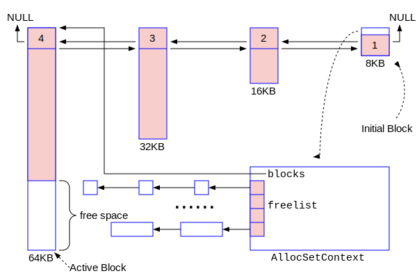
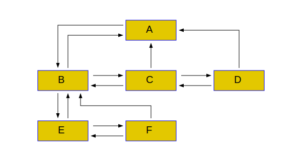
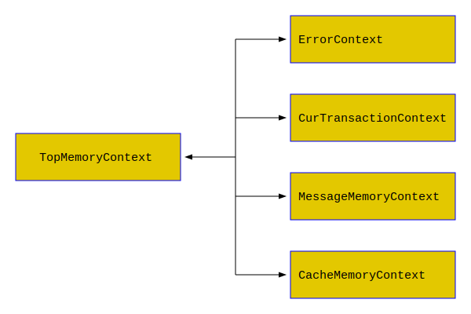
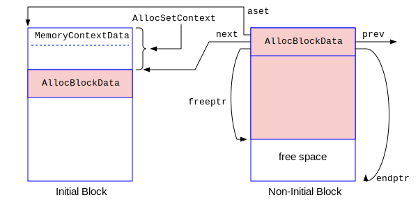
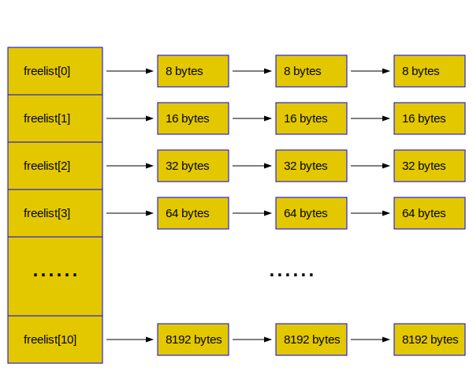

# 私有内存管理

对于一个进程来说，它的私有内存的分配是通过malloc()的系统调用来实现的，对申请后的内存则使用free()进行释放。本章介绍PostgreSQL私有内存管理子系统的深入细节知识。

注意：本章相对比较独立。建议读者在第一次阅读本书的时候，可以跳过本章。当你需要对palloc()/pfree()以及MemoryContextCreate()/MemoryContextReset()等本地内存管理函数的实现需要理解的时候，可以再回过头来学习本章的内容。

## 内存池概述

C语言作为排名第一的系统软件开发语言，它给了程序员最大的内存管理的自由度，也带来了很多潜在的问题。为了避免C语言编写的软件出现内存泄漏，高质量的软件往往采用内存池的技术，PostgreSQL也不例外。本节介绍一下内存池的基本思想。

### 一个简单的C语言小程序的例子:
首先我们研究一个简单的C语言的小程序，了解一下malloc()和free()以及C语言内存指针的基本使用。
```c
这里是演示的例子
```
从上例中我们可以看到。。。。。

### 内存池的思想

内存池技术的思想非常简单，就是“一次性批发，多次性零售”。我们知道malloc()和free()是系统调用，它的开销是非常大的。内存池的思想就是尽量减少对malloc()和free()的调用次数。一次性使用malloc分配大块内存，类似批发行为，然后在后续的小额内存申请中从这个大块内存中获取，只是简单的指针位置的移动，不再涉及系统调用，所以非常高效。这种申请行为类似零售。当这块大内存都零售完毕，而且这块大内存上所有的内存都不再使用后，一次性通过free()再把这块内存释放掉。这个思想是非常容易理解的。


## PostgreSQL内存池实现

PostgreSQL设计了一种非常巧妙的内存池管理机制，提供了palloc()和pfree()的内存池分配和释放接口函数，非常类似malloc()和free()的Linux系统调用。我们可以把PostgreSQL的内存池理解为一堆内存块(Block)的集合。这些Block是通过malloc()分配的，最终通过free()来进行释放，且它们组成一个双向链表。Block的大小有三个整型变量来控制，它们的单位均为字节(in bytes)：
- initBlockSize - 初始块的大小，通常初始块是8KB（8192个字节）。
- nextBlockSize - 下一次分配的Block的大小。
- maxBlockSize  - 最大Block的大小。

在PostgreSQL的缺省实现策略中，采用贪吃型的内存分配方案：每当通过malloc()分配一个新的Block时，它的体积都比前一次分配的Block大一倍。例如：第一个初始块的大小是8KB，则第二次分配的Block的大小是16KB，再下一次是32KB，再下一次是64KB，依次类推，直至新Block的体积等于maxBlockSize，就不再增加了，以后就按照maxBlockSize大小分配新的Block。这些Block组成一个双向链表，有头有尾。每次malloc()分配一个更大的Block之后，内存池都会把这个新鲜出炉的Block放在Block双向链表的头部。我们把该双向链表头部的第一个Block叫做“头部Block”或者“活跃Block”。内存池的整体结构如下图所示：



在上图中，最右边的Block是内存池刚刚创建时malloc()分配的初始块(Initial Block)，我们称之为初始Block。图中最左边的Block是头部Block。初始Block和其后诞生的Block有一点不同：在初始Block的头部有个“控制头”，这是一个C语言的结构体，其中的成员变量用于控制整个内存池的分配销毁等行为。在PostgreSQL中这个控制头叫AllocSetContext，如上图中的右下角的大矩形。它实际上是初始Block头部很小的一块区域，只是为了显示其细节，图中进行了放大。正因为初始Block和其后诞生的Block的头部有这个不同，所以产生了内存池的删除(Delete)和重置(Reset)两种操作的概念，具体含义稍后讨论。

从内存池的架构图中我们可以AllocSetContext有一个指针blocks，指向内存池中Block双向链表的头部Block。头部Block是内存池中最新诞生的Block，按照上述的内存池Block体积变化的规律，它也是当前内存池中体积最大的Block，且只有在它里面可能存在空闲内存用于未来的内存请求。在它后面的Block，要么是已经没有空闲内存了，要么其中残存的空闲内存都被加入到了一个空闲内存的管理列表freelist数组当中了。这就是为什么头部Block又被叫做活跃Block的原因。我们在内存池中寻找可用的空闲内存的时候，不需要沿着Block的双向链表进行遍历，而是直接在活跃Block，即头部Block中寻找空闲内存，这样就提高了搜索空闲内存的效率。Block组成的双链只是用于内存池销毁或者重置的时候进行遍历使用。

虽然内存池内部Block是malloc()和free()的基本单位，但是使用者是向内存池申请内存片(Chunk)。内存池(Pool)，内存块(Block)和内存片(Chunk)的关系简单地说：Pool包含一个或者多个Block，一个Block包含一个或者多个Chunk。任何一个Chunk只属于一个Block。任何一个Block只属于一个Pool。常见的内存池操作有：
- 内存池的创建(Create) ：通过malloc()创建初始Block，并初始化控制头的基本信息。
- 内存片的分配(Alloc) : 从内存池中申请一个Chunk，结果返回指向该Chunk的指针或者NULL（如果失败），类似malloc()。
- 内存片的释放(Free) ：把从某个内存池中申请的Chunk返回给该内存池，供后来的申请者继续使用，类似free()。
- 内存片的重新分配(Realloc）：调用者嫌手里的Chunk尺寸不合适，还给内存池，再从内存池里面申请一个大小合适的新Chunk。
- 内存池的删除(Delete) : 彻底销毁该内存池，其中的Block一个不留，包括初始Block。内存池删除后，指向控制头的指针就无效了。
- 内存池的重置(Reset) : 彻底销毁该内存池中除初始Block以外的所有Block，再把初始Block重置为该内存池刚创建(Create)时的初始状态。

### PostgreSQL内存池的相关数据结构

在PostgreSQL的内存池子系统中有几个数据结构：MemoryContext(内存上下文)，AllocSetContext(分配集合上下文)，AllocBlock/Block(内存块)和AllocChunk/Chunk(内存片)。初学者不容易搞明白它们的概念和之间关系。下面概述一下PostgreSQL内存池的一些特点和规律：
- 在PostgreSQL内存池中唯一通过malloc()/free()分配和释放内存的单位是Block。
- 在初始Block的头部是AllocSetContext结构，AllocSetContext的第一个成员变量是MemoryContext。AllocSetContext是控制头，控制内存池的分配和释放。MemoryContext是一种内存池管理的一种抽象设计，AllocSetContext则是MemoryContext的一种实现方式。MemoryContext还可以有其它内存策略的分配方式，但是AllocSetContext是它在PostgreSQL中的缺省实现，故而本章只讨论AllocSetContext的实现细节。AllocSetContext结构的第一个成员必须是Memorycontext，两者是包含和被包含的关系。所以一个指向AllocSetContext的指针，又可以被看做是指向MemoryContext的指针。
- Chunk是从Block里面切分的小内存片。调用者使用palloc()来申请Chunk，通过pfree()把Chunk归还给内存池。一个内存池包括一个或者多个Block，每一个Block中包含一个或者多个Chunk，但是整个内存池只有一个AllocSetContext(其中包括MemoryContext)，存在于初始Block的头部。
- 每一个Block都有一个指针变量aset指向初始Block头部的AllocSetContext结构。每一个Chunk的头部也有一个指针变量aset，当该Chunk不是空闲内存的时候，它的aset也指向初始Block头部的AllocSetContext结构。这样的设计可以保证从每一个Block和Chunk中都可以迅速地拿到内存池的控制头，以便进一步的操作。
- 多个PostgreSQL内存池形成树形结构，其根节点的内存池是TopMemoryContext，它在PostgreSQL实例运行的整个生命周期内都一直存在。

以上论述的具体含义，随着我们对相关数据结构和函数的源代码的分析，读者就会越来越搞明白。下面介绍一下PostgreSQL内存池的相关数据结构。

#### 内存上下文MemoryContextData

MemoryContextData是内存池的一种抽象的控制头，具体对内存池的创建、内存分配和释放、内存池的销毁等工作由具体的下一层的控制头来实现，在PostgreSQL中就是AllocSetContext。MemoryContextData的定义如下：
```c
/* in src/include/nodes/memnodes.h */
typedef struct MemoryContextData {
    NodeTag         type;                   /* identifies exact kind of context */
    bool            isReset;                /* T = no space alloced since last reset */
    bool            allowInCritSection; /* allow palloc in critical section */
    Size            mem_allocated;  /* 本内存池中所有已经分配的内存的大小, in byte */
    const MemoryContextMethods *methods;    /* 本池的相关内存分配释放的函数指针 */
    MemoryContext parent;           /* NULL if no parent (toplevel context) */
    MemoryContext firstchild;       /* head of linked list of children */
    MemoryContext prevchild;        /* previous child of same parent */
    MemoryContext nextchild;        /* next child of same parent */
    const char *name;                       /* context name (just for debugging) */
    const char *ident;                      /* context ID if any (just for debugging) */
    MemoryContextCallback *reset_cbs;       /* list of reset/delete callbacks */
} MemoryContextData;
/* in src/include/utils/palloc.h */
typedef struct MemoryContextData *MemoryContext;
```
MemoryContextData的重要成员变量的含义如下：
- type - 内存池的类型，目前没有太大的意义。
- isReset - 该内存池是否被重置过。内存池被重置后焕然一新，其里面没有任何Chunk被分配出去，isReset为true。一旦有Chunk被分配出去，isRest就为false。
- mem_allocated - 本内存池所有已经通过malloc()分配的Block的大小之和，即本内存池的总体积。
- methods - 内存池创建销毁等操作的函数指针
- name - 用于调试内存池使用，平时用不到。它必须是一个常量字符串，如"MyPool"，不能是一个字符串变量。
- ident - 也是用于调试的时候使用，这里可以忽略。

我们观察到MemoryContextData有几个指针，parent/firstchild/prevchild/nextchild，通过它们，多个内存池可以形成了一个树形结构，如下图所示，其中每一个矩形都表示一个内存池。



我窃以为：prevchild和nextchild变量的名字起的不好。它们实际上指向了自己的兄弟，所以应该叫做pre_sibling和next_sibling。

在PostgreSQL中只有一个TopMemoryContext，它是处于根节点位置的内存池。在它下面还有若干内存池。它们使用如下的全局变量来进行记录：
```c
/* in src/backend/utils/mmgr/mcxt.c */
MemoryContext TopMemoryContext = NULL;      /* 根内存池的指针 */
MemoryContext CurrentMemoryContext = NULL; /* 当前内存池的指针 */

MemoryContext ErrorContext = NULL;
MemoryContext PostmasterContext = NULL;
MemoryContext CacheMemoryContext = NULL;
MemoryContext MessageContext = NULL;
MemoryContext TopTransactionContext = NULL;
MemoryContext CurTransactionContext = NULL;
```
这些内存池在PostgreSQL实例的生命周期内形成如下的树形结构：




#### 分配集上下文AllocSetContext

AllocSetContext是MemoryContext的具体实现，也是MemoryContext在PostgreSQL中的缺省实现方式。它的定义如下：
```c
/* in src/backend/utils/mmgr/aset.c */
typedef struct AllocSetContext {
    MemoryContextData header;	/* 第一个成员必须是MemoryContextData */
    /* Info about storage allocated in this context: */
    AllocBlock	blocks;	       /* 指向本内存池的头部Block */
    AllocChunk  freelist[ALLOCSET_NUM_FREELISTS];  /* free chunk lists */
/* Allocation parameters for this context: */
    Size    initBlockSize;	/* initial block size */
    Size    maxBlockSize;	/* maximum block size */
    Size    nextBlockSize;	/* next block size to allocate */
    Size    allocChunkLimit;	/* effective chunk size limit */
    AllocBlock	keeper;			/* keep this block over resets */
/* freelist this context could be put in, or -1 if not a candidate: */
    int			freeListIndex;	/* index in context_freelists[], or -1 */
} AllocSetContext;

typedef AllocSetContext *AllocSet;
```
AllocSetContext的个成员变量的含义如下：
- header - MemoryContextData结构。其它方式的MemoryContextData的具体实现也必须把它设置为第一个成员。
- blocks - 指向本内存池内所有Block形成的双向链表的头部。
- freelist是一个数组，共计11个元素，它们指向空闲内存片AllocChunk的单向链表。具体含义后面会详细讨论。
- initBlockSize/maxBlockSizenextBlockSize - 三个控制Block体积的尺寸变量
- keeper - 指向初始Block。在内存池重置操作的时候通过它来判断哪一个Block是初始Block。
- freeListIndex - 后面有一小节来讨论它的作用。

#### 内存块AllocBlockData

AllocBlockData表示一个Block。每当内存池中分配一个新的Block的时候，它的头部就是AllocBlockData结构体。注意，初始Block不同，它的头部是AllocSetContext和AllocBlockData。初始Block和非初始Block的区别可以用下图来表示：



AllocBlockData的数据结构定义如下：
```c
/* in src/backend/utils/mmgr/aset.c */
typedef struct AllocBlockData {
    AllocSet    aset;	    /* 指向本内存池的初始块头部的AllocSetContext */
    AllocBlock	prev;	    /* Block双向链表的向前指针 */
    AllocBlock	next;	    /* Block双向链表的向后指针 */
    char       *freeptr;    /* 本块空闲内存的起始地址 */
    char       *endptr;	    /* 本块的结束地址 */
}  AllocBlockData;
typedef struct AllocBlockData *AllocBlock;
```
AllocBlockData的各成员变量的含义比较简单，请参考上面的注释。freeptr和endptr表示本块空闲内存的首尾指针，则本块空闲内存的大小为endptr - freeptr。

#### 内存片AllocChunkData

AllocChunkData表示一个Chunk，翻译成中文可以称为“内存片”。每次调用palloc()从内存池中分配的内存都是一个Chunk，其释放是通过pfree()来完整的。它的数据结构非常简单：
```c
/* in src/backend/utils/mmgr/aset.c */
typedef struct AllocChunkData {
    Size    size;   /* 8 bytes in X64 */
    /* aset is the owning aset if allocated, or the freelist link if free */
    void    *aset;  /* 8 bytes in X64 */
    /* there must not be any padding to reach a MAXALIGN boundary here! */
} AllocChunkData;

typedef struct AllocChunkData *AllocChunk;
```
我们可以用下图来表示它的内存结构：


一个Chunk可以分配头部和真正的数据区。头部分为本Chunk的大小和一个指针aset，共计16个字节。Chunk的要点如下：
- size指的是真正数据的大小，不包括头部的16个字节。
- aset指针是“一鱼两吃”：当本Chunk已经被分配使用，aset指向初始块头部的AllocSetContext。当本Chunk被pfree()释放会内存池中的时候，aset被用作在freelist中形成的单向链表中指向下一个成员的指针。这是程序设计上的一个小技巧，同一个指针在不同的情况下作为不同的用途。其具体含义我们在讨论freelist的时候再展开。
- palloc()申请的Chunk最终返回给调用者的指针是图中的p指针，不是Chunk的开头。
- aset指针和真正的数据之间是紧挨着的，不能有空隙。

为什么aset指针必须要和真正的数据紧挨着呢？这是因为我们往往需要根据p指针找到对应的Chunk头部，进而可以获得size和aset的信息。有时候也要根据Chunk指针获得指向真正数据的指针。在Chunk头部和指向数据的指针p之间没有空隙的话，只要把指针前后移动固定的位置就可以达到这个目的。请参考下面的相关操作的定义：
```c
/* in src/backend/utils/mmgr/aset.c */
#define ALLOC_CHUNKHDRSZ	     sizeof(struct AllocChunkData)
#define AllocPointerGetChunk(ptr)    ((AllocChunk)(((char *)(ptr)) - ALLOC_CHUNKHDRSZ))
#define AllocChunkGetPointer(chk)    ((AllocPointer)(((char *)(chk)) + ALLOC_CHUNKHDRSZ))

/* in src/backend/utils/mmgr/mcxt.c */
void pfree(void *pointer)
{
        MemoryContext context = GetMemoryChunkContext(pointer);
        context->methods->free_p(context, pointer);
}

/* in src/include/utils/memutils.h */
static inline MemoryContext GetMemoryChunkContext(void *pointer)
{
        MemoryContext context;
	/* 往前移动一个指针就可以拿到aset指针，指向MemoryContext */
        context = *(MemoryContext *) (((char *) pointer) - sizeof(void *)); 
        return context;
}
```
AllocPointerGetChunk是根据指向真正数据的指针ptr来获得指向AllocChunk的指针chk，其操作就是把ptr指针减16个字节就获得了，因为AllocChunkData结构的大小是16个字节(sizeof(struct AllocChunkData))。
```c
chk = ptr - sizeof(struct AllocChunkData) /* chk = ptr - 16 */
```
同样的道理，AllocChunkGetPointer是根据指向AllocChunk的指针chk获得指向真正数据的指针ptr。
```c
ptr = chk + sizeof(struct AllocChunkData) /* ptr = chk + 16 */
```
 理解了这些，大家对pfree()函数中的GetMemoryChunkContext就不难理解。

#### 空闲内存片数组freelist分析

在AllocSetContext结构里面有一个重要的成员变量freelist，它管理着通过pfree()释放回本内存池的Chunk。这些Chunk是空闲内存，但是却不可能被free()系统调用马上释放掉，因为必须整个Block才能被free()释放给操作系统。但是这些空闲的Chunk可以废物再利用，可以被未来的内存申请者所使用。所以每当有新的内存申请请求的时候，内存池首先会在freelist中寻找，找不到的时候再在Block中寻找。freelist是一个数组，共计11个成员，每一个成员都是一个AllocChunk指针。定义如下：
```c
/* in src/backend/utils/mmgr/aset.c */
#define ALLOCSET_NUM_FREELISTS	11
typedef struct AllocSetContext {
    ......
    AllocChunk  freelist[ALLOCSET_NUM_FREELISTS];
    ......
}
```
我们可以用下图来表示freelist的具体布局。



freelist[0]指向的Chunk，其体积统一为8个字节(真实数据的大小，不包括AllocChunk头部的16个字节)。freelist[1]指向的Chunk统一为16个字节大小，依次类推，最后一个成员freelist[10]指向的Chunk的体积统一为8192个字节。allocChunkLimit记录着freelist数组中Chunk的最大尺寸，它是一个阈值：当申请的内存的尺寸大于allocChunkLimit的时候，就无需在freelist数组中寻找了，而是直接申请新的Block。所以allocChunkLimit = 8192。其定义如下：
```c
/* in src/backend/utils/mmgr/aset.c */
#define ALLOC_MINBITS		3	/* smallest chunk size is 8 bytes */
#define ALLOCSET_NUM_FREELISTS	11
#define ALLOC_CHUNK_LIMIT	(1 << (ALLOCSET_NUM_FREELISTS-1+ALLOC_MINBITS))

/* in src/backend/utils/mmgr/aset.c:AllocSetContextCreateInternal */
    set->allocChunkLimit = ALLOC_CHUNK_LIMIT; /* ALLOC_CHUNK_LIMIT = 8192 */
```
假设用户要申请11个字节的内存，很显然它要在freelist[1]中找，因为这里的空闲Chunk的大小为16个字节。如果要申请60个字节，就在freelist[3]中寻找。这里面就有一个操作，根据内存的尺寸size寻找freelist数组的下标idx。其具体函数为：
```c
/* in src/backend/utils/mmgr/aset.c */
static inline int AllocSetFreeIndex(Size size)
{
int	idx;

    if (size > (1 << ALLOC_MINBITS)) { 
        /* 使用者必须确保size <= ALLOC_CHUNK_LIMIT，即size < = 8192 */
#ifdef HAVE__BUILTIN_CLZ
	idx = 31 - __builtin_clz((uint32) size - 1) - ALLOC_MINBITS + 1;
#else
	uint32		t,
				tsize;

	/* Statically assert that we only have a 16-bit input value. */
	StaticAssertStmt(ALLOC_CHUNK_LIMIT < (1 << 16),
					 "ALLOC_CHUNK_LIMIT must be less than 64kB");

	tsize = size - 1;
	t = tsize >> 8;
	idx = t ? pg_leftmost_one_pos[t] + 8 : pg_leftmost_one_pos[tsize];
	idx -= ALLOC_MINBITS - 1;
#endif

	Assert(idx < ALLOCSET_NUM_FREELISTS);
    }
    else idx = 0; /* size <= 8 就在freelist[0]中寻找 */

    return idx;
}

```

### PostgreSQL内存池的相关函数分析

#### 内存池操作的相关函数

```c
/* in src/include/nodes/memnodes.h */
typedef struct MemoryContextMethods {
    void    *(*alloc) (MemoryContext context, Size size);
    void     (*free_p) (MemoryContext context, void *pointer);
    void    *(*realloc) (MemoryContext context, void *pointer, Size size);
    void     (*reset) (MemoryContext context);
    void     (*delete_context) (MemoryContext context);
    Size     (*get_chunk_space) (MemoryContext context, void *pointer);
    bool     (*is_empty) (MemoryContext context);
    void     (*stats) (MemoryContext context,
		  MemoryStatsPrintFunc printfunc, void *passthru,
		  MemoryContextCounters *totals,
		  bool print_to_stderr);
} MemoryContextMethods;
```
在AllocSetContext中对应的实现函数如下：
```c
/* in src/backend/utils/mmgr/aset.c */
static const MemoryContextMethods AllocSetMethods = {
    AllocSetAlloc,
    AllocSetFree,
    AllocSetRealloc,
    AllocSetReset,
    AllocSetDelete,
    AllocSetGetChunkSpace,
    AllocSetIsEmpty,
    AllocSetStats
};
```
