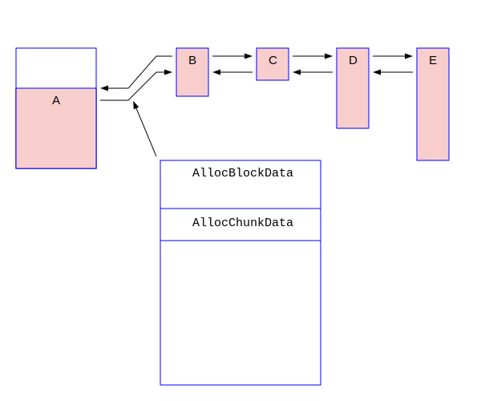

# 本地内存管理

本章介绍PostgreSQL本地的内存管理的深入细节知识。

注意：本章相对比较独立。建议读者在第一次阅读本书的时候，可以跳过本章。当你需要对palloc()/pfree()以及MemoryContextCreate()/MemoryContextReset()等本地内存管理函数的实现需要理解的时候，可以学习本章的内容。

## 概述
在PostgreSQL的内存池子系统中，有几个概念：MemoryContext(内存上下文)，AllocSetContext(分配集合上下文)，AllocBlock(内存块)和AllocChunk(内存切片)。初学者不容易搞明白。概而言之：
- 真正通过malloc()/free()分配和释放内存的单位是AllocBlock。
- AllocChunk是从AllocBlock里面切分小的内存片返回给调用者。
- MemoryContext和AllocSetContext是控制部分，控制内存池的分配和释放。其中MemoryContext是一种抽象，而AllocSetContext是MemoryContext的缺省实现方式。MemoryContext还可以有其它内存策略的分配方式。但是我们只讨论AllocSetContext。AllocSetContext结构的第一个成员就是Memorycontext。两者是包含和被包含的关系。
- 一个内存池包括多个AllocBlock，更多的AllocChunk，但是只有一个AllocSetContext(包括MemoryContext)。
- 多个内存池形成树形结构。

以上论述的具体含义，随着我们对相关数据结构和函数的源代码的分析，就会越来越清楚。

### MemoryContextData之分析

MemoryContextData的定义如下：
```c
/* in src/include/nodes/memnodes.h */
typedef struct MemoryContextData {
    NodeTag         type;                   /* identifies exact kind of context */
    bool            isReset;                /* T = no space alloced since last reset */
    bool            allowInCritSection; /* allow palloc in critical section */
    Size            mem_allocated;  /* 本内存池中所有已经分配的内存的大小, in byte */
    const MemoryContextMethods *methods;    /* 本池的相关内存分配释放的函数指针 */
    MemoryContext parent;           /* NULL if no parent (toplevel context) */
    MemoryContext firstchild;       /* head of linked list of children */
    MemoryContext prevchild;        /* previous child of same parent */
    MemoryContext nextchild;        /* next child of same parent */
    const char *name;                       /* context name (just for debugging) */
    const char *ident;                      /* context ID if any (just for debugging) */
    MemoryContextCallback *reset_cbs;       /* list of reset/delete callbacks */
} MemoryContextData;
/* in src/include/utils/palloc.h */
typedef struct MemoryContextData *MemoryContext;
```
我们观察到MemoryContextData有几个指针，parent/firstchild/prevchild/nextchild，通过它们，多个内存池可以形成了一个树形结构，如下图所示：


我窃以为：prevchild和nextchild变量的名字起的不好。它们实际上指向了自己的兄弟，所以应该叫做pre_sibling和next_sibling。

在PostgreSQL中只有一个TopMemoryContext，它是处于根节点位置的内存池。在它下面还有若干内存池。它们使用如下的全局变量来进行记录：
```c
/* in src/backend/utils/mmgr/mcxt.c */
MemoryContext TopMemoryContext = NULL;      /* 根内存池的指针 */
MemoryContext CurrentMemoryContext = NULL; /* 当前内存池的指针 */

MemoryContext ErrorContext = NULL;
MemoryContext PostmasterContext = NULL;
MemoryContext CacheMemoryContext = NULL;
MemoryContext MessageContext = NULL;
MemoryContext TopTransactionContext = NULL;
MemoryContext CurTransactionContext = NULL;
```
这些内存池形成如下的树形结构，其中每一个矩形都表示一个内存池。


#### 数据结构AllocChunkData分析

首先我们先分析一下AllocChunk。AllocChunk，或者称为Chunk，可以翻译成中文的“内存片”。每次调用palloc()分配的内存都是一个Chunk，它的释放是通过pfree()来完整的。它的数据结构非常简单：
```c
/* in src/backend/utils/mmgr/aset.c */
typedef struct AllocChunkData {
    Size    size;   /* 8 bytes in X64 */
    /* aset is the owning aset if allocated, or the freelist link if free */
    void    *aset;  /* 8 bytes in X64 */
    /* there must not be any padding to reach a MAXALIGN boundary here! */
} AllocChunkData;

typedef struct AllocChunkData *AllocChunk;
```
我们可以用下图来表示它的内存结构


一个Chunk可以分配头部和真正的数据区。头部分为本Chunk的大小和一个指针aset，共计16个字节。Chunk的要点如下：
- size指的是真正数据的大小，不包括头部的16个字节。
- aset指针是“一鱼两吃”：当本Chunk已经被分配使用，aset指向它的AllocSetContext，否则指向在freelist中形成单向链表结构。
- 最终返回给调用者的指针是图中的p指针。
- aset指针和真正的数据之间是紧挨着的，不能有空隙。

其中第二条是一个小技巧，就是同一个指针在不同的情况下作为不同的用途。这个我们会在后面看到。为什么aset指针必须要和真正的数据紧挨着呢？这是因为最终返回给用户的指针是图中的p指针，而不是Chunk的开头。这里面有一个技巧，请参考下面的定义：
```c
/* in src/backend/utils/mmgr/aset.c */
#define ALLOC_CHUNKHDRSZ	     sizeof(struct AllocChunkData)
#define AllocPointerGetChunk(ptr)    ((AllocChunk)(((char *)(ptr)) - ALLOC_CHUNKHDRSZ))
#define AllocChunkGetPointer(chk)    ((AllocPointer)(((char *)(chk)) + ALLOC_CHUNKHDRSZ))

/* in src/backend/utils/mmgr/mcxt.c */
void pfree(void *pointer)
{
        MemoryContext context = GetMemoryChunkContext(pointer);
        context->methods->free_p(context, pointer);
}

/* in src/include/utils/memutils.h */
static inline MemoryContext GetMemoryChunkContext(void *pointer)
{
        MemoryContext context;
	/* 往前移动一个指针就可以拿到aset指针，指向MemoryContext */
        context = *(MemoryContext *) (((char *) pointer) - sizeof(void *)); 
        return context;
}
```
我们可以看到，如果想要释放一个指针p，在它之前有16个字节的AllocChunkData结构，所以p往前移动16个字节就可以拿到AllocChunk指针，p往前移动8个字节，就可以拿到aset指针，进而可以访问AllocSetContext结构。反过来，拿到AllocChunk指针，往后移动16个字节的ALLOC_CHUNKHDRSZ就可以拿到真正的数据指针。


当完成初始化后，它的内存分配如下图所示：
```c
/* in src/backend/utils/mmgr/aset.c */
typedef struct AllocSetContext {
    MemoryContextData header;	/* Standard memory-context fields */
    /* Info about storage allocated in this context: */
    AllocBlock	blocks;			/* head of list of blocks in this set */
	AllocChunk	freelist[ALLOCSET_NUM_FREELISTS];	/* free chunk lists */
	/* Allocation parameters for this context: */
	Size		initBlockSize;	/* initial block size */
	Size		maxBlockSize;	/* maximum block size */
	Size		nextBlockSize;	/* next block size to allocate */
	Size		allocChunkLimit;	/* effective chunk size limit */
	AllocBlock	keeper;			/* keep this block over resets */
	/* freelist this context could be put in, or -1 if not a candidate: */
	int			freeListIndex;	/* index in context_freelists[], or -1 */
} AllocSetContext;

typedef AllocSetContext *AllocSet;
```
```c
/* in src/backend/utils/mmgr/aset.c */
typedef struct AllocBlockData
{
	AllocSet	aset;			/* aset that owns this block */
	AllocBlock	prev;			/* prev block in aset's blocks list, if any */
	AllocBlock	next;			/* next block in aset's blocks list, if any */
	char	   *freeptr;		/* start of free space in this block */
	char	   *endptr;			/* end of space in this block */
} AllocBlockData;

typedef struct AllocBlockData *AllocBlock;
```


当完成初始化后，它的内存分配如图所示.


当完成初始化后，它的内存分配如图所示.



当完成初始化后，它的内存分配如图所示.

#### 函数AllocSetContextCreate分析

initBlockSize必须是按8字节对齐，且最小值为1024个字节。但是第一次分配的时候，通常是8K。

```c
/* in src/include/utils/memutils.h */
#define AllocSetContextCreate AllocSetContextCreateInternal
/* in src/backend/utils/mmgr/aset.c */
MemoryContext AllocSetContextCreateInternal(MemoryContext parent,
    const char *name, Size minContextSize, Size initBlockSize, Size maxBlockSize)
{
int		freeListIndex;
Size		firstBlockSize;
AllocSet	set;
AllocBlock	block;
   ......
    /* Determine size of initial block */
    firstBlockSize = MAXALIGN(sizeof(AllocSetContext)) + ALLOC_BLOCKHDRSZ + ALLOC_CHUNKHDRSZ;
    if (minContextSize != 0)
	firstBlockSize = Max(firstBlockSize, minContextSize);
    else
	firstBlockSize = Max(firstBlockSize, initBlockSize);
    /* 通常调用本函数的时候，firstBlockSize = 8192 */
    set = (AllocSet) malloc(firstBlockSize); /* 真刀真枪地分配第一个Block */
    if (set == NULL) { /* 就报错退出 */ }

    /* 首块的开始是 AllocSetContext结构，它的开始是MemoryContextData结构*/
    block = (AllocBlock) (((char *) set) + MAXALIGN(sizeof(AllocSetContext)));
    block->aset = set; /* 指向本块的头部 */
    block->freeptr = ((char *) block) + ALLOC_BLOCKHDRSZ;
    block->endptr = ((char *) set) + firstBlockSize;
    block->prev = NULL;
    block->next = NULL;

	/* Remember block as part of block list */
    set->blocks = block;
    /* keeper永远指向首块，在reset操作的时候保证本块不会被释放 */
    set->keeper = block; 

    set->initBlockSize = initBlockSize;
    set->maxBlockSize = maxBlockSize;
    set->nextBlockSize = initBlockSize;
    set->freeListIndex = freeListIndex;

    set->allocChunkLimit = ALLOC_CHUNK_LIMIT;
    /* #define ALLOC_BLOCKHDRSZ    MAXALIGN(sizeof(AllocBlockData)) */
    /* #define ALLOC_CHUNKHDRSZ	   sizeof(struct AllocChunkData) */
    while ((Size) (set->allocChunkLimit + ALLOC_CHUNKHDRSZ) >
	   (Size) ((maxBlockSize - ALLOC_BLOCKHDRSZ) / ALLOC_CHUNK_FRACTION))
	set->allocChunkLimit >>= 1;

    /* 初始化MemoryContext中的内容 */
    MemoryContextCreate((MemoryContext) set, T_AllocSetContext,
	                &AllocSetMethods, parent, name);
    /* 目前为止，只分配的第一个块，大小为firstBlockSize，记录在案 */
    ((MemoryContext) set)->mem_allocated = firstBlockSize;

    return (MemoryContext) set; /* 返回首块的头部指针 */
}
```
当上述函数执行完毕后，其内存布局如下图所示：


#### 函数AllocSetAlloc分析

AllocSetAlloc()函数是真正执行内存分配的函数。如果分配成功就返回分配的内存，否则返回NULL。
它分两种情况：
- 如果要分配内存的尺寸size大于allocChunkLimit阈值，则直接调用malloc()分配。
- 如果要分配的内存尺寸size小于allocChunkLimit阈值，则在freelist中寻找。

我们先分析第一种情况的代码流程：
```c
/* in src/backend/utils/mmgr/aset.c */
static void * AllocSetAlloc(MemoryContext context, Size size)
{
AllocSet	set = (AllocSet) context;
AllocBlock	block;
AllocChunk	chunk;
int		fidx;
Size		chunk_size;
Size		blksize;

    /* 如果请求分配的内存大小超过阈值，就直接调用malloc分配一个整块 */
    if (size > set->allocChunkLimit) {
        chunk_size = MAXALIGN(size); /* 先把尺寸按照8字节做齐 */
/* 每一个块要有一个头部ALLOC_BLOCKHDRSZ。而且本块只有一个Chunk，所以也要加一个ALLOC_CHUNKHDRSZ */
        blksize = chunk_size + ALLOC_BLOCKHDRSZ + ALLOC_CHUNKHDRSZ;
        block = (AllocBlock) malloc(blksize); /* 直接调用malloc()进行真是的内存分配 */
        if (block == NULL) return NULL; /* 分配失败就返回NULL */

        context->mem_allocated += blksize; /* 调整本set中以分配内存的总体尺寸 */
        /* 把本block的aset指针指向本set的AllocSetContext */
	block->aset = set;
	/* 因为本块整个算一个Chunk，所以没有空闲空间了，调整一下首位指针指向尾部 */
	block->freeptr = block->endptr = ((char *) block) + blksize;

	chunk = (AllocChunk) (((char *) block) + ALLOC_BLOCKHDRSZ);
	chunk->aset = set;
	chunk->size = chunk_size;
        if (set->blocks != NULL) {
		block->prev = set->blocks;
		block->next = set->blocks->next;
		if (block->next) block->next->prev = block;
		set->blocks->next = block;
	} else {
		block->prev = NULL;
		block->next = NULL;
		set->blocks = block;
	}
	return AllocChunkGetPointer(chunk);
    }
    ...
}

```
上述代码走完后，其内存布局如下图所示：


#### 函数AllocSetContextCreate分析

#### 函数AllocSetContextCreate分析

#### 函数AllocSetContextCreate分析

#### 函数AllocSetContextCreate分析

#### 函数AllocSetContextCreate分析

#### 函数AllocSetContextCreate分析

#### 函数AllocSetContextCreate分析
当完成初始化后，它的内存分配如图所示.

当完成初始化后，它的内存分配如图所示.

当完成初始化后，它的内存分配如图所示.


