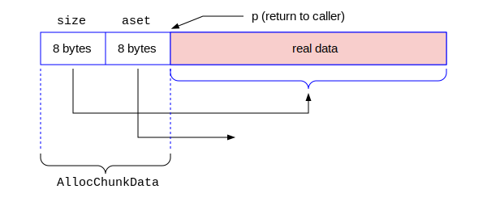

# 本地内存管理

本章介绍PostgreSQL本地的内存管理的深入细节知识。

注意：本章相对比较独立。建议读者在第一次阅读本书的时候，可以跳过本章。当你需要对palloc()/pfree()以及MemoryContextCreate()/MemoryContextReset()等本地内存管理函数的实现需要理解的时候，可以学习本章的内容。


MemoryContextData的定义如下：
```c
/* in src/include/nodes/memnodes.h */
typedef struct MemoryContextData {
    NodeTag         type;                   /* identifies exact kind of context */
        /* these two fields are placed here to minimize alignment wastage: */
    bool            isReset;                /* T = no space alloced since last reset */
    bool            allowInCritSection; /* allow palloc in critical section */
    Size            mem_allocated;  /* track memory allocated for this context */
    const MemoryContextMethods *methods;    /* virtual function table */
    MemoryContext parent;           /* NULL if no parent (toplevel context) */
    MemoryContext firstchild;       /* head of linked list of children */
    MemoryContext prevchild;        /* previous child of same parent */
    MemoryContext nextchild;        /* next child of same parent */
    const char *name;                       /* context name (just for debugging) */
    const char *ident;                      /* context ID if any (just for debugging) */
    MemoryContextCallback *reset_cbs;       /* list of reset/delete callbacks */
} MemoryContextData;
/* in src/include/utils/palloc.h */
typedef struct MemoryContextData *MemoryContext;
```
当完成初始化后，它的内存分配如下图所示：
```c
/* in src/backend/utils/mmgr/aset.c */
typedef struct AllocSetContext {
    MemoryContextData header;	/* Standard memory-context fields */
    /* Info about storage allocated in this context: */
    AllocBlock	blocks;			/* head of list of blocks in this set */
	AllocChunk	freelist[ALLOCSET_NUM_FREELISTS];	/* free chunk lists */
	/* Allocation parameters for this context: */
	Size		initBlockSize;	/* initial block size */
	Size		maxBlockSize;	/* maximum block size */
	Size		nextBlockSize;	/* next block size to allocate */
	Size		allocChunkLimit;	/* effective chunk size limit */
	AllocBlock	keeper;			/* keep this block over resets */
	/* freelist this context could be put in, or -1 if not a candidate: */
	int			freeListIndex;	/* index in context_freelists[], or -1 */
} AllocSetContext;

typedef AllocSetContext *AllocSet;
```
```c
/* in src/backend/utils/mmgr/aset.c */
typedef struct AllocBlockData
{
	AllocSet	aset;			/* aset that owns this block */
	AllocBlock	prev;			/* prev block in aset's blocks list, if any */
	AllocBlock	next;			/* next block in aset's blocks list, if any */
	char	   *freeptr;		/* start of free space in this block */
	char	   *endptr;			/* end of space in this block */
} AllocBlockData;

typedef struct AllocBlockData *AllocBlock;
```

```c
/* in src/backend/utils/mmgr/aset.c */
typedef struct AllocChunkData {
	/* size is always the size of the usable space in the chunk */
	Size		size;
	/* aset is the owning aset if allocated, or the freelist link if free */
    void	   *aset;
    /* there must not be any padding to reach a MAXALIGN boundary here! */
} AllocChunkData;

typedef struct AllocChunkData *AllocChunk;
```
AllocChunk



当完成初始化后，它的内存分配如图所示.
```c
/* in src/backend/utils/mmgr/mcxt.c */
void pfree(void *pointer)
{
        MemoryContext context = GetMemoryChunkContext(pointer);

        context->methods->free_p(context, pointer);
        VALGRIND_MEMPOOL_FREE(context, pointer);
}

/* in src/include/utils/memutils.h */
static inline MemoryContext GetMemoryChunkContext(void *pointer)
{
        MemoryContext context;

        /*
         * Try to detect bogus pointers handed to us, poorly though we can.
         * Presumably, a pointer that isn't MAXALIGNED isn't pointing at an
         * allocated chunk.
         */
        Assert(pointer != NULL);
        Assert(pointer == (void *) MAXALIGN(pointer));

        /*
         * OK, it's probably safe to look at the context.
         */
        context = *(MemoryContext *) (((char *) pointer) - sizeof(void *));

        AssertArg(MemoryContextIsValid(context));

        return context;
}

```

当完成初始化后，它的内存分配如图所示.

当完成初始化后，它的内存分配如图所示.

当完成初始化后，它的内存分配如图所示.

当完成初始化后，它的内存分配如图所示.

当完成初始化后，它的内存分配如图所示.


