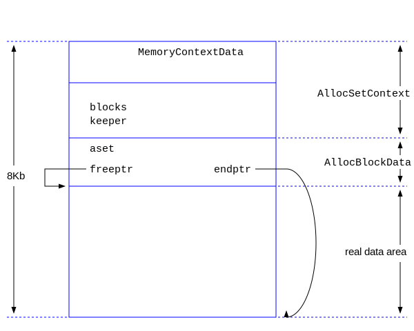

#### 函数AllocSetContextCreate分析

initBlockSize必须是按8字节对齐，且最小值为1024个字节。但是第一次分配的时候，通常是8K。

```c
/* in src/include/utils/memutils.h */
#define AllocSetContextCreate AllocSetContextCreateInternal
/* in src/backend/utils/mmgr/aset.c */
MemoryContext AllocSetContextCreateInternal(MemoryContext parent,
    const char *name, Size minContextSize, Size initBlockSize, Size maxBlockSize)
{
int		freeListIndex;
Size		firstBlockSize;
AllocSet	set;
AllocBlock	block;
   ......
    /* Determine size of initial block */
    firstBlockSize = MAXALIGN(sizeof(AllocSetContext)) + ALLOC_BLOCKHDRSZ + ALLOC_CHUNKHDRSZ;
    if (minContextSize != 0)
	firstBlockSize = Max(firstBlockSize, minContextSize);
    else
	firstBlockSize = Max(firstBlockSize, initBlockSize);
    /* 通常调用本函数的时候，firstBlockSize = 8192 */
    set = (AllocSet) malloc(firstBlockSize); /* 真刀真枪地分配第一个Block */
    if (set == NULL) { /* 就报错退出 */ }

    /* 首块的开始是 AllocSetContext结构，它的开始是MemoryContextData结构*/
    block = (AllocBlock) (((char *) set) + MAXALIGN(sizeof(AllocSetContext)));
    block->aset = set; /* 指向本块的头部 */
    block->freeptr = ((char *) block) + ALLOC_BLOCKHDRSZ;
    block->endptr = ((char *) set) + firstBlockSize;
    block->prev = NULL;
    block->next = NULL;

	/* Remember block as part of block list */
    set->blocks = block;
    /* keeper永远指向首块，在reset操作的时候保证本块不会被释放 */
    set->keeper = block; 

    set->initBlockSize = initBlockSize;
    set->maxBlockSize = maxBlockSize;
    set->nextBlockSize = initBlockSize;
    set->freeListIndex = freeListIndex;

    set->allocChunkLimit = ALLOC_CHUNK_LIMIT;
    /* #define ALLOC_BLOCKHDRSZ    MAXALIGN(sizeof(AllocBlockData)) */
    /* #define ALLOC_CHUNKHDRSZ	   sizeof(struct AllocChunkData) */
    while ((Size) (set->allocChunkLimit + ALLOC_CHUNKHDRSZ) >
	   (Size) ((maxBlockSize - ALLOC_BLOCKHDRSZ) / ALLOC_CHUNK_FRACTION))
	set->allocChunkLimit >>= 1;

    /* 初始化MemoryContext中的内容 */
    MemoryContextCreate((MemoryContext) set, T_AllocSetContext,
	                &AllocSetMethods, parent, name);
    /* 目前为止，只分配的第一个块，大小为firstBlockSize，记录在案 */
    ((MemoryContext) set)->mem_allocated = firstBlockSize;

    return (MemoryContext) set; /* 返回首块的头部指针 */
}
```
当上述函数执行完毕后，其内存布局如下图所示：


