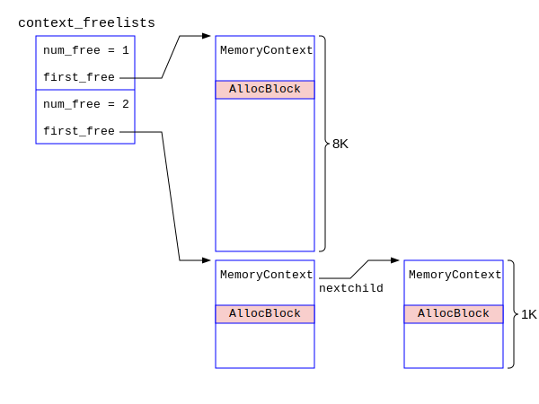

## 内存池的操作函数

在熟悉了内存池的相关结构后，我们就要来考察内存池的相关操作函数了。PostgreSQL定义了若干函数指针，分别指向不同的操作函数，并且把这些函数打包成一个结构体，便于管理。其定义如下：
```c
/* in src/include/nodes/memnodes.h */
typedef struct MemoryContextMethods {
    void    *(*alloc) (MemoryContext context, Size size);
    void     (*free_p) (MemoryContext context, void *pointer);
    void    *(*realloc) (MemoryContext context, void *pointer, Size size);
    void     (*reset) (MemoryContext context);
    void     (*delete_context) (MemoryContext context);
    Size     (*get_chunk_space) (MemoryContext context, void *pointer);
    bool     (*is_empty) (MemoryContext context);
    void     (*stats) (MemoryContext context,
		  MemoryStatsPrintFunc printfunc, void *passthru,
		  MemoryContextCounters *totals,
		  bool print_to_stderr);
} MemoryContextMethods;
```
上述函数指针在AllocSetContext中对应的实现函数如下：
```c
/* in src/backend/utils/mmgr/aset.c */
static const MemoryContextMethods AllocSetMethods = {
    AllocSetAlloc,         /* 对应alloc */
    AllocSetFree,          /* 对应free_p */
    AllocSetRealloc,       /* 对应realloc */
    AllocSetReset,         /* 对应reset */
    AllocSetDelete,        /* 对应delete_context */
    AllocSetGetChunkSpace, /* 对应get_chunk_space */
    AllocSetIsEmpty,       /* 对应is_empty */
    AllocSetStats          /* 对应stas */ 
};
```

### 函数AllocSetContextCreate之分析

AllocSetContextCreate函数的作用是创建内存池。PostgreSQL每次查询的时候，都要为该查询创建内存池，查询结束后再释放内存池。这种频繁的操作势必会频繁调用malloc()和free()。为了减少对malloc()和free()的系统调用，PostgreSQL建立了一个context_freelist来跟踪记录即将被删除的内存池。某一个内存池在被删除之前，会首先释放它内部的除了初始Block以外的所有Block。对于只有一个初始Block的内存池来说，与其free()掉这最后一个Block，不如把它挂在一个context_freelist的单向列表中，下一次再创建内存池的时候，就直接在这个单向列表中寻找一个内存池拿来用，这样就不用free()和malloc()了。这是性能上的一个优化。PostgreSQL维系了两个单向列表，一个是初始Block为8K的正常内存池，另外一个是初始Block为1K的小内存池的申请。示意图见下：



num_free记录了本单向链表中的内存池的个数。first_free则指向了内存池单向链表的头部。单向链表之间用MemoryContext的nextchild指针来进行维护。
```c
/* in src/backend/utils/mmgr/aset.c */
typedef struct AllocSetFreeList {
    int  num_free;		  /* 本单向列表中成员的数目 */
    AllocSetContext *first_free;  /* 本单向列表的头 */
} AllocSetFreeList;

/* context_freelists[0] is for default params, [1] for small params */
static AllocSetFreeList context_freelists[2] = { {0, NULL}, {0, NULL} };
```

在AllocSetContextCreate函数的入口参数中，除了初始Block的大小initBlockSize以外，还可以指定一个minContextSize变量。两者的关系是：如果minContextSize的值不是0，则初始Block的大小就以它为准，否则就以initBlockSize为准。这增加了对内存池中Block尺寸控制的精细化。具体逻辑是：
```c
    /* 先计算初始Block的一个最小值 */
    firstBlockSize = MAXALIGN(sizeof(AllocSetContext)) + ALLOC_BLOCKHDRSZ + ALLOC_CHUNKHDRSZ;
    /* 如果minContextSize的值不是0，初始Block的大小就以它为准，否则就以initBlockSize为准 */
    if (minContextSize != 0) firstBlockSize = Max(firstBlockSize, minContextSize);
    else firstBlockSize = Max(firstBlockSize, initBlockSize);
```
AllocSetContextCreate函数的源代码分析如下：
```c
/* in src/include/utils/memutils.h */
#define AllocSetContextCreate AllocSetContextCreateInternal
/* in src/backend/utils/mmgr/aset.c */
MemoryContext AllocSetContextCreateInternal(MemoryContext parent,
    const char *name, Size minContextSize, Size initBlockSize, Size maxBlockSize)
{
int		freeListIndex;
Size		firstBlockSize;
AllocSet	set;
AllocBlock	block;
    ......

    /* 初始Block的大小分为1K和8K两种情况 */
    /* #define ALLOCSET_DEFAULT_MINSIZE   0          */
    /* #define ALLOCSET_DEFAULT_INITSIZE  (8 * 1024) */
    /* #define ALLOCSET_SMALL_MINSIZE     0          */
    /* #define ALLOCSET_SMALL_INITSIZE  (1 * 1024)   */
    if (minContextSize == ALLOCSET_DEFAULT_MINSIZE && initBlockSize == ALLOCSET_DEFAULT_INITSIZE)
        freeListIndex = 0;
    else if (minContextSize == ALLOCSET_SMALL_MINSIZE && initBlockSize == ALLOCSET_SMALL_INITSIZE)
        freeListIndex = 1;
    else freeListIndex = -1;
   
    if (freeListIndex >= 0) { /* 该内存池的尺寸是1K或者8K */
        AllocSetFreeList *freelist = &context_freelists[freeListIndex];
	if (freelist->first_free != NULL) { /* 如果在该freelist上中以前释放的内存池 */
	    /* Remove entry from freelist */
            set = freelist->first_free;
            freelist->first_free = (AllocSet) set->header.nextchild;
            freelist->num_free--;

            /* Update its maxBlockSize; everything else should be OK */
	    set->maxBlockSize = maxBlockSize;
	    /* Reinitialize its header, installing correct name and parent */
	    MemoryContextCreate((MemoryContext) set, T_AllocSetContext, &AllocSetMethods, parent, name);
	    ((MemoryContext) set)->mem_allocated = set->keeper->endptr - ((char *) set);
	
            return (MemoryContext) set;
	}
    }
   
    /* 初始Block中必须包含AllocSetContext, AllocBlockData和AllocChunkData三个结构，所以它的最小值如下 */
    firstBlockSize = MAXALIGN(sizeof(AllocSetContext)) + ALLOC_BLOCKHDRSZ + ALLOC_CHUNKHDRSZ;
    /* 如果minContextSize的值不为0，则就以该值作为本内存池初始Block的尺寸，否则就以initBlockSize为准 */
    if (minContextSize != 0) firstBlockSize = Max(firstBlockSize, minContextSize);
    else firstBlockSize = Max(firstBlockSize, initBlockSize);
    /* 通常调用本函数的时候，firstBlockSize = 8192 */
    set = (AllocSet) malloc(firstBlockSize); /* 真刀真枪地分配第一个Block */
    if (set == NULL) { /* 就报错退出 */ }

    /* 初始Block的开始部分是AllocSetContext结构，AllocSetContext的开始是MemoryContextData结构 */
    /* 初始Block真正开始的地方是AllocSetContext下面，按照8字节做齐 */
    block = (AllocBlock) (((char *) set) + MAXALIGN(sizeof(AllocSetContext)));
    block->aset = set; /* 指向本块的头部 */
    block->freeptr = ((char *) block) + ALLOC_BLOCKHDRSZ; /* 本Block的空闲内存开始地址 */
    block->endptr = ((char *) set) + firstBlockSize; /* 本Block的空闲内存结束的地址，即块尾 */
    block->prev = NULL;  /* 现在内存池的Block双向链表上只有初始Block一个 */
    block->next = NULL;

    set->blocks = block;  /* blocks指向本内存池Block的双向链表的头部，即活跃Block */
    set->keeper = block;  /* keeper永远指向初始Block，在reset操作的时候才能保证本块不会被free()释放 */

    set->initBlockSize = initBlockSize;
    set->maxBlockSize = maxBlockSize;
    set->nextBlockSize = initBlockSize;
    set->freeListIndex = freeListIndex;

    set->allocChunkLimit = ALLOC_CHUNK_LIMIT; /* 设置一下本内存池的Chunk的阈值 */
    /* #define ALLOC_BLOCKHDRSZ    MAXALIGN(sizeof(AllocBlockData)) */
    /* #define ALLOC_CHUNKHDRSZ	   sizeof(struct AllocChunkData) */
    while ((Size) (set->allocChunkLimit + ALLOC_CHUNKHDRSZ) >
	   (Size) ((maxBlockSize - ALLOC_BLOCKHDRSZ) / ALLOC_CHUNK_FRACTION))
	set->allocChunkLimit >>= 1;

    /* 初始化MemoryContext中的内容 */
    MemoryContextCreate((MemoryContext) set, T_AllocSetContext, &AllocSetMethods, parent, name);
    /* 目前为止，只分配的第一个块，大小为firstBlockSize，记录在案 */
    ((MemoryContext) set)->mem_allocated = firstBlockSize;

    return (MemoryContext) set; /* 返回首块的头部指针 */
}
```
当上述函数执行完毕后，其内存布局如下图所示：


### 函数AllocSetReset之分析

AllocSetReset函数的作用是重置本内存池，即只保留初始Block，其余的Block全部通过free()的系统调用释放给操作系统。AllocSet中的成员变量keeper指针在内存池创建以后就始终指向初始Block，在该内存池的整个生命周期中都不会改变，所以只要判断一个block指针是否和keeper指针相等就能知道这个block是否是初始Block。AllocSetReset的源代码分析如下：
```c
/* in src/backend/utils/mmgr/aset.c */
static void AllocSetReset(MemoryContext context)
{
    AllocSet	set = (AllocSet) context;
    AllocBlock	block;
    /* keepersize中记录了初始Block的大小 */
    Size	keepersize = set->keeper->endptr - ((char *) set);

    /* 快速地把freelist数组清空，MemSetAligned是一个宏，其定义在src/include/c.h中 */
    MemSetAligned(set->freelist, 0, sizeof(set->freelist));

    block = set->blocks; /* block指向了Block双向链表的头部 */
    set->blocks = set->keeper; /* 把set的blocks指针指向初始Block，这是本内存池刚创建后的状态 */

    while (block != NULL) { /* 开始遍历block的双向链表 */
        AllocBlock  next = block->next; /* 拿到下一个block */
        if (block == set->keeper) { /* 这个block是初始Block，所以需要重新设置其中的内容，但是并不释放它 */
	    /* 注意block指向的是AllocSetContext结构的后面,所以加一个Block的头，就是该block的数据区 */
	    char *datastart = ((char *) block) + ALLOC_BLOCKHDRSZ; 
            wipe_mem(datastart, block->freeptr - datastart); /* 把本block数据区残存的内容消除掉 */
            block->freeptr = datastart; /* 把本block的空闲内存的起始指针指向数据区的开始部分 */
	    block->prev = NULL; /* 把初始Block从双向链表中切除下来，该双向链表中的其它block都会被free()释放掉 */
	    block->next = NULL;
	} else { /* 这个block是非初始Block */
	    /* 调整本内存池总体大小的值，减去即将释放的block的大小 */
	    context->mem_allocated -= block->endptr - ((char *) block);
	    /* 把本block残存的内容消除掉，避免安全隐患 */
 	    wipe_mem(block, block->freeptr - ((char *) block));
            free(block); /* 释放这个Block给操作系统 */
	}
	block = next; /* 继续处理双向链表中的下一个block */
    }
    /* 当除了初始Block以外的所有Block都被释放后，本内存池的体积就是初始Block的大小 */
    Assert(context->mem_allocated == keepersize);
    /* 现在本内存池中只有一个初始Block，调整一下nextBlockSize */
    set->nextBlockSize = set->initBlockSize;
}
```

#### 函数AllocSetDelete分析

AllocSetDelete函数的工作是销毁内存池，它的入口参数就是一个指向该内存池初始Block头部的MemoryContext指针context。在本函数执行完毕后，context指针指向的内存池片甲不留，context指针也失效了，不能在继续引用里面的内容了。其源代码分析如下：
```c
/* in src/backend/utils/mmgr/aset.c */
static void AllocSetDelete(MemoryContext context)
{
    AllocSet  set = (AllocSet) context;
    AllocBlock block = set->blocks; /* block指向Block双向链表的头部，即活跃Block */
    Size  keepersize = set->keeper->endptr - ((char *) set); /* 计算初始Block的尺寸 */

    if (set->freeListIndex >= 0) { /* 对于即将被删除的内存池，可以把它重置后放在context_freelist数组中 */
        AllocSetFreeList *freelist = &context_freelists[set->freeListIndex];
	/* 如果本内存池没有被重置过，则首先把它重置一下，释放掉除初始Block以外的所有Block */
        if (!context->isReset)  MemoryContextResetOnly(context);
        if (freelist->num_free >= MAX_FREE_CONTEXTS) { 
	    /* 如果该context_freelist中的备用内存池太多了，就把这个context_freelist上所有的内存池都释放掉 */
            while (freelist->first_free != NULL) { /* 依次遍历该单向链表 */
                AllocSetContext *oldset = freelist->first_free; /* 摘下来第一个成员 */
                freelist->first_free = (AllocSetContext *) oldset->header.nextchild;
                freelist->num_free--;
                free(oldset);
            }
            Assert(freelist->num_free == 0);
        }

        /* 把本次即将释放的内存池挂在这个context_freelist上  */
        set->header.nextchild = (MemoryContext) freelist->first_free;
        freelist->first_free = set;
        freelist->num_free++;
        return;
    }
    
    /* 开始遍历block指向的双向链表，从头到尾，依次释放该内存池中所有的Block */
    while (block != NULL) {
        AllocBlock next = block->next;
        /* 如果不是初始Block。因为set还在初始Block上呢，不能现在释放初始Block */
        if (block != set->keeper)
	    /* 调整内存池的总体积大小，减去即将释放的Block的体积 */
            context->mem_allocated -= block->endptr - ((char *) block);
            if (block != set->keeper) free(block); /* 释放所有的非初始Block */
            block = next; /* 遍历下一个Block */
    }
    /* 最后只剩下一块Block，那就是初始Block，所以内存池总大小等于初始Block的大小 */
    Assert(context->mem_allocated == keepersize);
    /* 最后释放初始Block，自然set指针也就失效了 */
    free(set);
}
```
