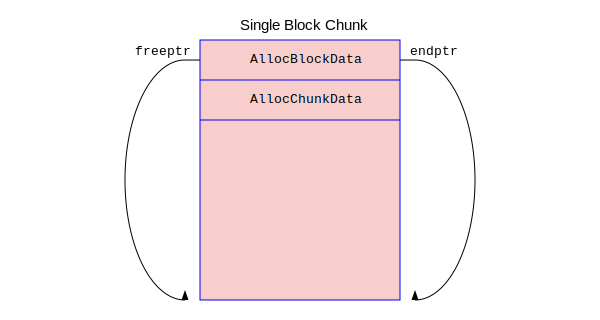

#### 函数AllocSetAlloc分析

AllocSetAlloc函数承担了处理从内存池中分配Chunk的主要工作，如果分配成功就返回分配的内存，否则返回NULL。每当接受了调用者发来的内存申请，内存池采用如下的分配策略来寻找合适的内存片：
1. 内存池有一个申请内存的阈值allocChunkLimit。当调用者申请的内存尺寸超过这个阈值，就简单通过malloc()分配一个Block给调用者，且把这个Block挂在头部Block后面。我们称这个整个Block只有一个内存片的Chunk为“单块Chunk”。
2. 在申请的内存尺寸小于该阈值的时候，内存池会首先在freelist数组中寻找可能合适的空闲内存，如果找到了就把内存片的指针返回给调用者。
3. 如果找不到，就在blocks指向的Block链表头部的那个Block中寻找空闲空间，找到后就把内存片的指针返回给调用者。
4. 如果在头部Block中找不到，就再申请一个新的Block，其体积往往是当前头部Block的两倍，直至其尺寸达到了maxBlockSize后就不再增加了。

单块Chunk可以用如下图来表示。



从图中可以看到，对于一个chunk，如果它的size大于allocChunkLimit，就可以判断它为单块chunk。把chunk指针往低地址移动ALLOC_BLOCKHDRSZ个字节就可以拿到它所在的Block的指针了，其中ALLOC_BLOCKHDRSZ是把AllocBlockData结构按照8字节做齐，它的定义见下。这个Chunk是直接使用malloc()分配的，对它的释放自然也是用free()释放它所在的Block了。
```c
/* in src/backend/utils/mmgr/aset.c */
#define ALLOC_BLOCKHDRSZ	MAXALIGN(sizeof(AllocBlockData))
```

设置阈值的主要原因是，如果所有内存都放在freelist空闲内存数组中，就存在一种可能性：某一个申请者一下子申请了100M的内存，使用后通过pfree()释放它。这个100M的大块内存被挂在了freelist数组上，后面的内存申请者再也没有申请过这么大块的内存了，就导致这块大内存迟迟不能被释放给操作系统，白白占用了宝贵的内存资源。所以freelist的上限控制在8K。对于超过8K大小的内存申请，内存池会直接申请一个整块给申请者，释放的时候也是直接free()释放，就避免了这种内存浪费的情况。

AllocSetAlloc函数比较长，所以我们分上面列的几种情况分段分析它的源代码：

```c
/* in src/backend/utils/mmgr/aset.c */
static void * AllocSetAlloc(MemoryContext context, Size size)
{
AllocSet	set = (AllocSet) context;
AllocBlock	block;
AllocChunk	chunk;
int		fidx;
Size		chunk_size;
Size		blksize;

    if (size > set->allocChunkLimit) { /* 申请者申请的内存大小超过了阈值，按单块Chunk处理，后面分析这种情况 */}
    /* 现在申请的Chunk的尺寸低于阈值，则可以在freelist上先查找有没有空闲的Chunk */
    fidx = AllocSetFreeIndex(size); /* 根据申请内存的尺寸计算freelist的下标 */
    chunk = set->freelist[fidx];
    if (chunk != NULL) { /* freelist[fidx]上有空闲的chunk */
        Assert(chunk->size >= size); /* 当然，空闲chunk的尺寸肯定是大于等于申请的内存尺寸的 */
        set->freelist[fidx] = (AllocChunk) chunk->aset; /* 把第一个chunk从单链上摘下来 */
        chunk->aset = (void *) set; /* 这个chunk即将被使用了，把它的aset指针指向本内存池的初始Block的头部 */
        return AllocChunkGetPointer(chunk); /* 返回该chunk的真正数据指针 */
    }
    /* 计算真正要分配的chunk的大小，肯定是8,16,32,64 ... 8192这样的值 */
    chunk_size = (1 << ALLOC_MINBITS) << fidx;
    Assert(chunk_size >= size); /* 经过调整后的chunk_size肯定是大于申请内存的size的 */

    if ((block = set->blocks) != NULL) { /* block肯定不为NULL，因为至少它指向了初始Block */
        /* 现在block指向了头部Block，它也是活跃Block。分配内存肯定是在头部Block上进行 */
	Size  availspace = block->endptr - block->freeptr; /* 计算头部Block的空闲内存的大小*/

	if (availspace < (chunk_size + ALLOC_CHUNKHDRSZ)) /* 本Block的空闲内存不够 */
	{
			/*
			 * The existing active (top) block does not have enough room for
			 * the requested allocation, but it might still have a useful
			 * amount of space in it.  Once we push it down in the block list,
			 * we'll never try to allocate more space from it. So, before we
			 * do that, carve up its free space into chunks that we can put on
			 * the set's freelists.
			 *
			 * Because we can only get here when there's less than
			 * ALLOC_CHUNK_LIMIT left in the block, this loop cannot iterate
			 * more than ALLOCSET_NUM_FREELISTS-1 times.
			 */
			while (availspace >= ((1 << ALLOC_MINBITS) + ALLOC_CHUNKHDRSZ))
			{
				Size		availchunk = availspace - ALLOC_CHUNKHDRSZ;
				int			a_fidx = AllocSetFreeIndex(availchunk);

				/*
				 * In most cases, we'll get back the index of the next larger
				 * freelist than the one we need to put this chunk on.  The
				 * exception is when availchunk is exactly a power of 2.
				 */
				if (availchunk != ((Size) 1 << (a_fidx + ALLOC_MINBITS)))
				{
					a_fidx--;
					Assert(a_fidx >= 0);
					availchunk = ((Size) 1 << (a_fidx + ALLOC_MINBITS));
				}

				chunk = (AllocChunk) (block->freeptr);

				/* Prepare to initialize the chunk header. */
				VALGRIND_MAKE_MEM_UNDEFINED(chunk, ALLOC_CHUNKHDRSZ);

				block->freeptr += (availchunk + ALLOC_CHUNKHDRSZ);
				availspace -= (availchunk + ALLOC_CHUNKHDRSZ);

				chunk->size = availchunk;
#ifdef MEMORY_CONTEXT_CHECKING
				chunk->requested_size = 0;	/* mark it free */
#endif
				chunk->aset = (void *) set->freelist[a_fidx];
				set->freelist[a_fidx] = chunk;
			}

			/* 把block设为为NULL，表明需要通过malloc()申请一个新的Block作为头部Block */
			block = NULL;
		}
	}

    if (block == NULL) { 
        /* 头部Block的空闲内存不够了，需要通过malloc()申请一个新的Block作为头部Block
	 * 我们在后面分析这段代码
	*/ 
    }
    
    /* 现在block指向的头部Block里面的空闲内存足够分配了，现在进行真正的分配 */
    chunk = (AllocChunk) (block->freeptr); /* 拿到头部Block的空闲内存起始地址 */
    /* chunk_size是真正的数据的大小，前面还要加一个AllocChunk的头 */
    block->freeptr += (chunk_size + ALLOC_CHUNKHDRSZ);  /* 调整一下头部Block的空闲内存起始地址 */
    Assert(block->freeptr <= block->endptr);
    /* 设置一下这个chunk的头部信息，注意它的aset指向了初始Block的头部中的AllocSetContext */
    chunk->aset = (void *) set; 
    chunk->size = chunk_size;
    /* 返回该chunk真正的数据区指针 */
    return AllocChunkGetPointer(chunk);
}
```

我们先分析申请单块chunk情况的代码流程：
```c
/* in src/backend/utils/mmgr/aset.c */
static void * AllocSetAlloc(MemoryContext context, Size size)
{
AllocSet	set = (AllocSet) context;
AllocBlock	block;
AllocChunk	chunk;
int		fidx;
Size		chunk_size;
Size		blksize;

    /* 如果请求分配的内存大小超过阈值，就直接调用malloc分配一个整块 */
    if (size > set->allocChunkLimit) {
        chunk_size = MAXALIGN(size); /* 先把尺寸按照8字节做齐 */
        /* 每一个块要有一个头部ALLOC_BLOCKHDRSZ。而且本块只有一个Chunk，所以也要加一个ALLOC_CHUNKHDRSZ */
        blksize = chunk_size + ALLOC_BLOCKHDRSZ + ALLOC_CHUNKHDRSZ;
        block = (AllocBlock) malloc(blksize); /* 直接调用malloc()进行真是的内存分配 */
        if (block == NULL) return NULL; /* 分配失败就返回NULL */

        context->mem_allocated += blksize; /* 调整本set中以分配内存的总体尺寸 */
        /* 把本block的aset指针指向本内存池的AllocSetContext */
	block->aset = set;
	/* 因为本块整个算一个Chunk，所以没有空闲空间了，调整一下首位指针指向尾部 */
	block->freeptr = block->endptr = ((char *) block) + blksize;

	chunk = (AllocChunk) (((char *) block) + ALLOC_BLOCKHDRSZ);
	chunk->aset = set;
	chunk->size = chunk_size;
        if (set->blocks != NULL) { /* 把这个新malloc的块插入到头部Block的后面 */
		block->prev = set->blocks;
		block->next = set->blocks->next;
		if (block->next) block->next->prev = block;
		set->blocks->next = block;
	} else { /* 这部分代码永远都走不到，因为set->blocks在内存池被销毁之前不可能为空 */
		block->prev = NULL;
		block->next = NULL;
		set->blocks = block;
	}
	/* 返回该chunk真正的数据区指针 */
	return AllocChunkGetPointer(chunk);
    }
    ...
}
```
上述代码走完后，其内存布局如下图所示：


我们接着分析申请的Chunk的尺寸小于8192，但是头部Block中的空闲内存不够的情况，上源码：
```c
/* in src/backend/utils/mmgr/aset.c:AllocSetAlloc */
Size  blksize;

if (block == NULL) {
    Size    required_size;

	blksize = set->nextBlockSize; 
	set->nextBlockSize <<= 1; /* 把下一次要分配的Block的大小加倍！*/
	if (set->nextBlockSize > set->maxBlockSize) /* 如果超过了最大值，就以最大值为准 */
		set->nextBlockSize = set->maxBlockSize;

	required_size = chunk_size + ALLOC_BLOCKHDRSZ + ALLOC_CHUNKHDRSZ;
	while (blksize < required_size) blksize <<= 1; /* 如果加倍的尺寸还不够分配本Chunk的，就再加倍 */

	block = (AllocBlock) malloc(blksize); /* 真刀真枪地从操作系统中申请内存 */
        /* 如果malloc()失败，且Block的尺寸大于1M，就尝试减半Block的尺寸，再试试 */
	while (block == NULL && blksize > 1024 * 1024) {
	    blksize >>= 1;
	    if (blksize < required_size) break; /* 肯定不能低于要分配的chunk的大小 */
	    block = (AllocBlock) malloc(blksize);
	}
	if (block == NULL) return NULL; /* 屡次尝试malloc()都失败了，这是老天的问题，返回NULL */
        /* 现在新的Block分配成功了，就调整一下内存池的总体积 */
	context->mem_allocated += blksize;

	block->aset = set;
	block->freeptr = ((char *) block) + ALLOC_BLOCKHDRSZ;
	block->endptr = ((char *) block) + blksize;
        /* 把新申请的Block挂在内存池Block双向链表的开始的位置，作为新的头部Block */
	block->prev = NULL;
	block->next = set->blocks;
	if (block->next) block->next->prev = block;
	set->blocks = block;
}
/* 下面就走正常的从Block中分Chunk的流程，请参考前面的分析结果 */

```


#### 函数AllocSetContextCreate分析

#### 函数AllocSetContextCreate分析

#### 函数AllocSetContextCreate分析

#### 函数AllocSetContextCreate分析

#### 函数AllocSetContextCreate分析

#### 函数AllocSetContextCreate分析

#### 函数AllocSetContextCreate分析
当完成初始化后，它的内存分配如图所示.

当完成初始化后，它的内存分配如图所示.

当完成初始化后，它的内存分配如图所示.

