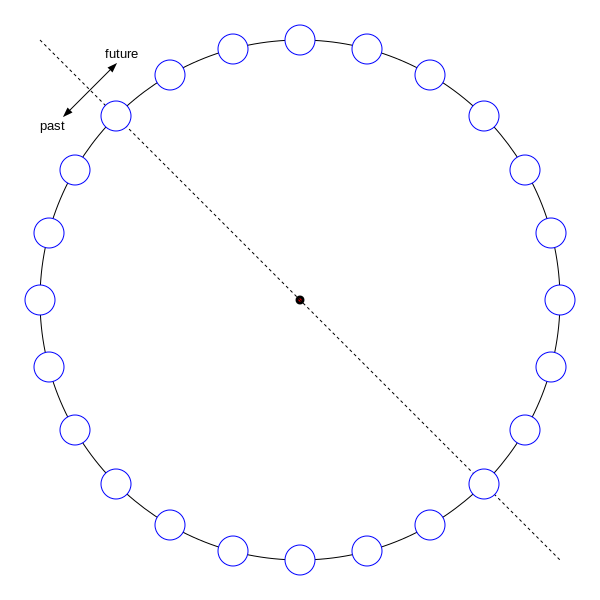
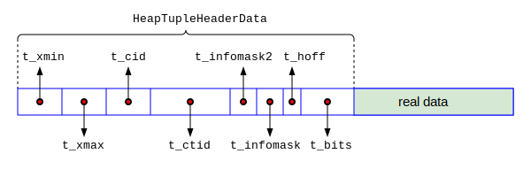

# 事务和Vacuum 

## 事务

注意

### 事务标识(Transaction ID)


```
postgres=# BEGIN;
BEGIN
postgres=*# SELECT txid_current();
 txid_current
--------------
          742
(1 row)

```




```c
typedef uint32 TransactionId; /* 4 bytes */
typedef uint32 CommandId;     /* 4 bytes */
typedef uint16 OffsetNumber;
/* in src/include/storage/block.h */
typedef struct BlockIdData {
    uint16          bi_hi;
    uint16          bi_lo;
} BlockIdData;

/* in src/include/storage/itemptr.h */
typedef struct ItemPointerData {
    BlockIdData ip_blkid;
    OffsetNumber ip_posid;
} ItemPointerData;

/* in src/include/access/htup_details.h */
typedef struct HeapTupleFields {
    TransactionId t_xmin;           /* inserting xact ID */
    TransactionId t_xmax;           /* deleting or locking xact ID */
    union {
        CommandId      t_cid;          /* inserting or deleting command ID, or both */
        TransactionId  t_xvac;   /* old-style VACUUM FULL xact ID */
    } t_field3;
} HeapTupleFields;

typedef struct DatumTupleFields {
    int32   datum_len_;             /* varlena header (do not touch directly!) */
    int32   datum_typmod;   /* -1, or identifier of a record type */
    Oid     datum_typeid;   /* composite type OID, or RECORDOID */
    /*
     * datum_typeid cannot be a domain over composite, only plain composite,
     * even if the datum is meant as a value of a domain-over-composite type.
     * This is in line with the general principle that CoerceToDomain does not
     * change the physical representation of the base type value.
     *
     * Note: field ordering is chosen with thought that Oid might someday
     * widen to 64 bits.
     */
} DatumTupleFields;

#define FIELDNO_HEAPTUPLEHEADERDATA_INFOMASK2 2
#define FIELDNO_HEAPTUPLEHEADERDATA_INFOMASK  3
#define FIELDNO_HEAPTUPLEHEADERDATA_HOFF      4
#define FIELDNO_HEAPTUPLEHEADERDATA_BITS      5
struct HeapTupleHeaderData {
    union {
        HeapTupleFields t_heap;
        DatumTupleFields t_datum;
    } t_choice;

    ItemPointerData t_ctid;      /* current TID of this or newer tuple (or a
                                  * speculative insertion token) */
    /* Fields below here must match MinimalTupleData! */
    uint16          t_infomask2;    /* number of attributes + various flags */
    uint16          t_infomask;             /* various flag bits, see below */
    uint8           t_hoff;                 /* sizeof header incl. bitmap, padding */
    /* ^ - 23 bytes - ^ */
    bits8           t_bits[FLEXIBLE_ARRAY_MEMBER];  /* bitmap of NULLs */
    /* MORE DATA FOLLOWS AT END OF STRUCT */
};
```




