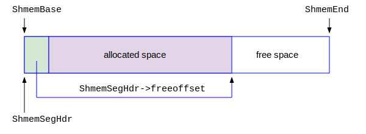

## 内存的对齐

我们知道，现在计算机分为32位（32-bit）和64位（64-bit）。早期的计算机还有8-bit和16-bit的。由于IT技术的迅猛发展，现在市场上的智能手机都是64-bit的了，更不要说更强大的服务器了，所以本书假设PostgreSQL运行在64-bit的计算机上。所谓32-bit计算机，指的是CPU的数据线和地址线都是32 bits(4个字节/byte)。64-bit的计算机的CPU数据总线和地址总线是64 bits（8个字节/byte）。以64-bit计算机来说，CPU一次性从内存中会读取8个字节。譬如你想访问6号地址的一个字节，则CPU一条读取指令就把0到7号地址的共计8个字节都读入CPU内部，然后只挑选6号的一个字节使用。如果你想读取6号到9号地址之间的4个字节，则CPU需要读取两次。第一次读取0到7号地址的8个字节，第二次读取8到15号地址的8个字节，共计16个字节，然后再在CPU内部拼接后获得6到9号的4个字节。这种操作无疑是低效率的。


为了提高CPU读写内存的速度，就产生了“对齐”的概念，其思想就是确保每次要访问的数据的起始地址和内存大小都是8的整数倍，也叫做按8字节对齐。PostgreSQL的源代码中大量充斥着对齐的操作。我们来分析它的技术实现。其中使用最多的的MAXALIGN宏。下面是它的定义：
```c
/* src/include/pg_config.h */
#define MAXIMUM_ALIGNOF 8

/* src/include/c.h */
#define TYPEALIGN(ALIGNVAL,LEN)  \
        (((uintptr_t) (LEN) + ((ALIGNVAL) - 1)) & ~((uintptr_t) ((ALIGNVAL) - 1)))


#define MAXALIGN(LEN)                   TYPEALIGN(MAXIMUM_ALIGNOF, (LEN))

```
pg_config.h这个头文件并不包含在你下载的源码包里面。它是运行configure命令后，判断操作系统是64-bit还是32-bit以后，产生的一个文件。你可以打开看一下，里面就是各种宏定义，非常简单。MAXIMUM_ALIGNOF的值为8,则意味着是64-bit的操作系统。

在PostgreSQL官方文档中，有这么一句话：
```
Code in PostgreSQL should only rely on language features available in the C99 standard
```
它明确无误地告诉想为PostgreSQL添砖加瓦的C程序员，PostgreSQL的源代码必须遵循C99的标准。这个标准是20多年前的产物了，已经比较古老了。之所以有这个规定，是为了确保PostgreSQL可以运行在各种操作系统上，包括比较古老的操作系统。在C99的标准中，uintptr_t是系统库头文件<stdint.h>定义的一个变量。在64-bit平台上，你可以把它理解为一个8字节的无符号整数。根据上面的宏定义，我们可以展开MAXALIGN(x)的定义为: 
```c
MAXALIGN(x) = ((uintptr_t) (x) + 7) & 0xFFFFFFFFFFFFFFF8
```
我建议大家手动展开这个宏，心算一下。这样才能感觉更加踏实，理解更加深刻。我们看到，如果一个值x是8的整数倍，则MAXALIGN(x) = x（包括 MAXALIGN(0) = 0）。如果x不是8的整数倍，就往比它大的那个8的整数倍上凑。例如21，它介于16 (= 2 X 8)和24 (= 3 X 8) 之间，它就往24上凑。MAXALIGN(21) = 24，果然是按8个字节对齐。

我们在PostgreSQL的源代码中常常看到这样的代码：alignedSize = MAXALIGN(size); 其中size表示要分配的内存大小(单位是byte)。首先要通过类似的语句把它按8字节做齐，得到一个新的内存大小尺寸的变量alignedSize。alignedSize肯定就是8的整数倍了。这样申请下来的内存块的大小就是按照8字节对齐的了，提高了软件的性能。这种编程手法也值得我们借鉴和运用。

PostgreSQL的源码中还有其它类似的对齐定义的宏，如CACHELINEALIGN是按照128字节对齐的。我们在分析源码的时候遇到了再手动分析理解一下也不迟。这里就不过多介绍了。


