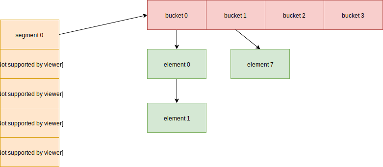

## Postgresql 动态哈希表实现

https://zhmin.github.io/posts/postgresql-dynamic-hash/

### 哈希函数(Hash Function)
函数的概念
```
y = f(x)
```
我们看一下PostgreSQL里面使用的Hash函数
```c
/* in /common/hashfn.c */
uint32 hash_bytes(const unsigned char *k, int keylen)
```
给定一个keylen长度的key，经过哈希函数hash_bytes就产生了一个32-bit的无符号整数。


### 结构图



```c
/* hash_search operations */
typedef enum {
    HASH_FIND,        /* 查找key  */
    HASH_ENTER,       /* 查找key，如果没有就创建 */
    HASH_REMOVE,      /* 查找key，如果有就移除 */
    HASH_ENTER_NULL   /* 查找key，如果没有就创建，如果out of memory返回NULL */
} HASHACTION;
```
HASHACTION（Hash动作）有四个，其含义经参考上面代码的注释部分。
 
哈希函数的定义在src/common/hashfn.c中。
