# 测试页面

本文档用于测试Github Markdown的各种效果。

<!---
显示SVG图像测试！

显示SVG图像测试！

显示SVG图像测试！

显示SVG图像测试！

显示SVG图像测试！

显示SVG图像测试！

显示SVG图像测试！

-->
显示SVG图像测试！

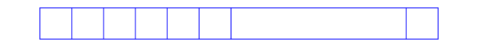

显示SVG图像测试！

显示SVG图像测试！

显示SVG图像测试！

显示SVG图像测试！

显示SVG图像测试！

显示SVG图像测试！

显示SVG图像测试！

显示SVG图像测试！

显示SVG图像测试！

显示SVG图像测试！

显示SVG图像测试！

显示SVG图像测试！

显示SVG图像测试！

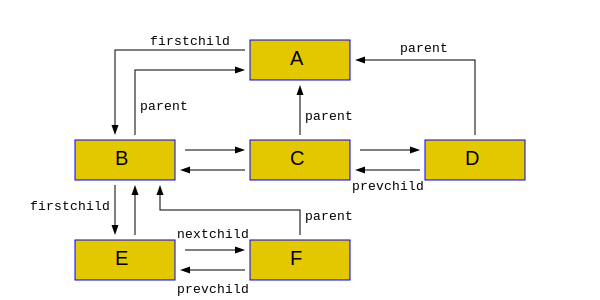

显示SVG图像测试！

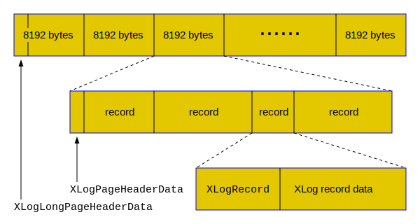

显示SVG图像测试！

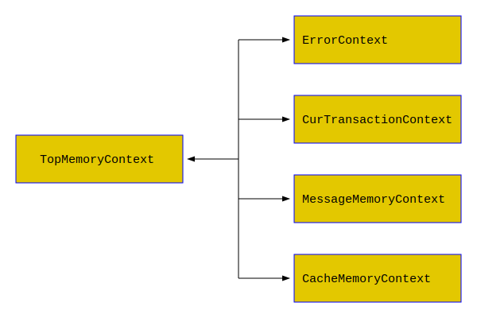

显示SVG图像测试！

显示SVG图像测试！

显示SVG图像测试！

显示SVG图像测试！

显示SVG图像测试！

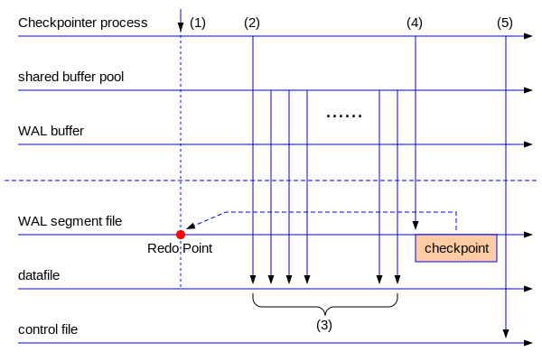

显示SVG图像测试！

显示SVG图像测试！

显示SVG图像测试！

显示SVG图像测试！

显示SVG图像测试！

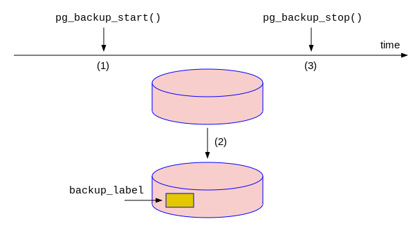

显示SVG图像测试！

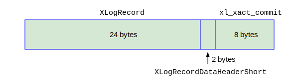

显示SVG图像测试！

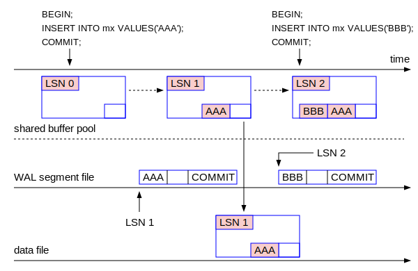

显示SVG图像测试！

显示SVG图像测试！

显示SVG图像测试！

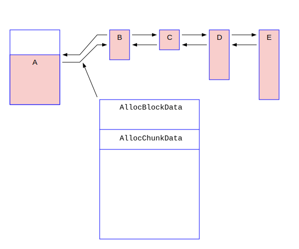

显示SVG图像测试！

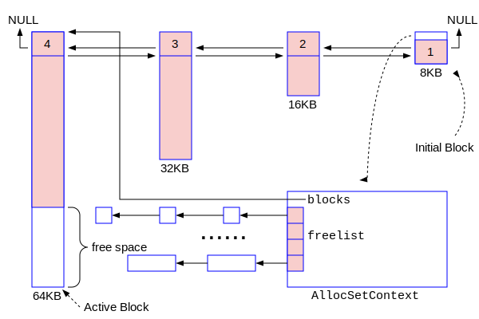

显示SVG图像测试！

显示SVG图像测试！

显示SVG图像测试！

显示SVG图像测试！

显示SVG图像测试！

显示SVG图像测试！

显示SVG图像测试！

显示SVG图像测试！

显示SVG图像测试！

显示SVG图像测试！

显示SVG图像测试！

显示SVG图像测试！

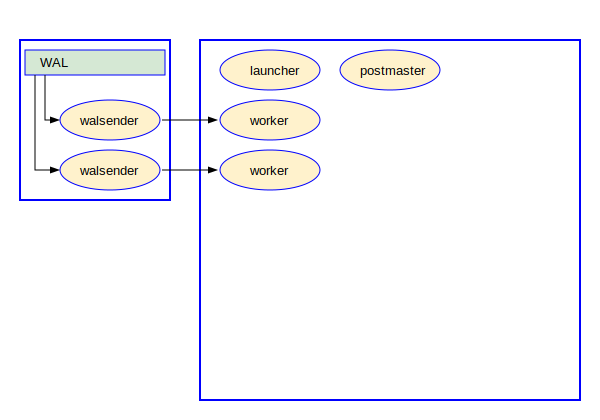

显示SVG图像测试！

显示SVG图像测试！

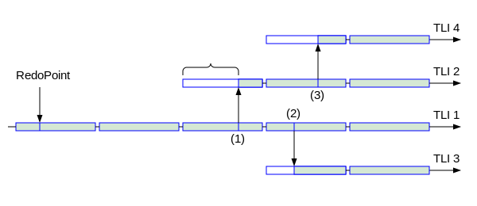

显示SVG图像测试！

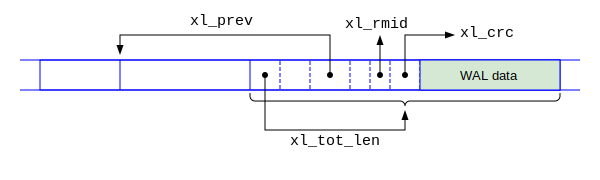

显示SVG图像测试！

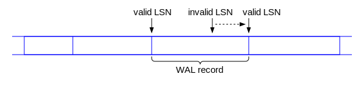

显示SVG图像测试！

显示SVG图像测试！

